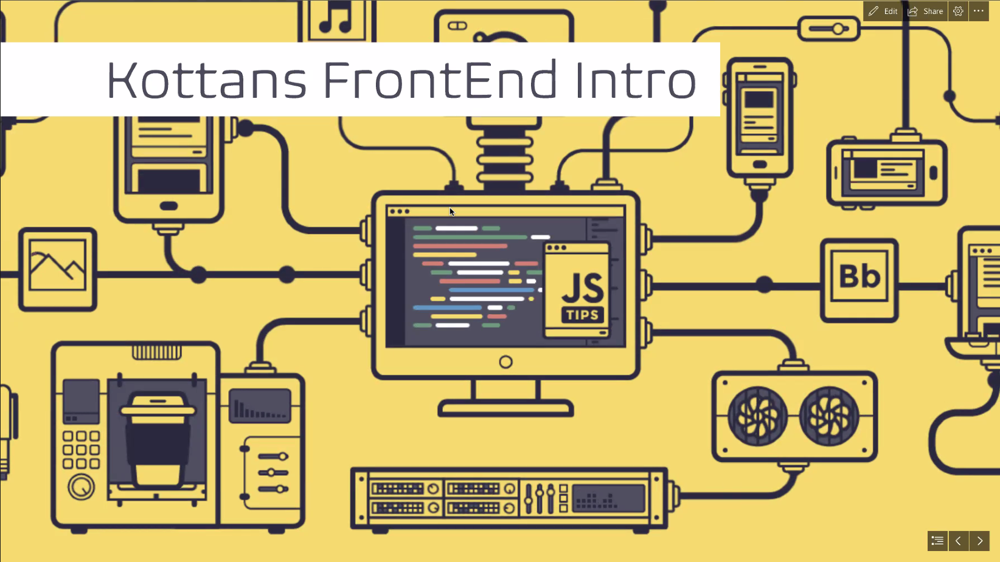

# Лекция 0

[Назад](../../README.md)

# Вступление

Обычно есть нулевая лекция, где больше рассказывают *о курсе*. Т.к. карантин, будет сразу первая лекция со знаниями по вебу. 

# "Научи себя учиться"

*by Artem Sychov*

Миф о том, что мозг не устаёт - не правда. Отдыхи и перерывы в момент обучения очень важны. Основные ошибки при учебе:

- заставлять себя учиться долго вечером
- не делать перерывы
- неправильный эмоциональный настрой. Мозг может возненавидеть информацию и перестать её воспринимать.
- не награждать себя после обучения (можно вкусняшками, например)

Так же важно работать в группе. Информация гораздо лучше усваивается когда у вас есть кто-то кто может вас проверить, перефразировать, сформулировать материал с другой точки зрения.

Собеседование - отдельный навык, которому нужно учиться. Это стрессовые ситуация и это почти всегда тяжело. В собеседованиях слишком много факторов - настроение, здоровье, берущие интервью и т.д. Не нужно зацикливаться если собеседование было провальным. Сделайте работу над ошибками, награждайте себя и учитесь дальше.

Нужно быть готовым к тому, что в данной сфере нужно будет учиться всегда, т.к. технологии развиваются очень быстро.

*Вопрос*

> Что делать новичкам, которые учатся-учатся, но ничего не получается?

*Ответ*

> Отвлечься. Пойти прогуляться, перекусить, попробовать другой вид деятельности. Так же можно обратиться за помощью к другим студентам - другая точка зрения поможет взглянуть на информацию по-другому.

---

*Вопрос*

> Как учиться если отработал целый день и вечером пришёл домой без сил? Утром лучше?

*Ответ*

> Утром однозначно лучше работать. Если нет возможности и время есть только вечером - лучше сделать перерыв\отдых перед учёбой обязательно.

---

**Важно!** Данный курс - не спринт, а марафон, у нас нет цели быстро всё выучить прямо сейчас. Четкая размеренная учеба - всегда продуктивнее, чем переработки. Если тратить на учебу слишком много времени, начинает накапливаться усталость и продуктивность. Брать и учить всё сразу и глубоко так же непродуктивно, как оставить всё на последний момент. Лучше стараться всё планировать. Если по плану нужно что-то почитать, а у вас нет сил - не насилуйте мозг и отдохните.

---

*Вопрос*

> Как продолжить фундаментально, если на работе уже хотят чтобы писали на Фреймворке?

*Ответ*

> Вопрос приоритетов. Если фреймворк действительно какой-то важный и распространённый, вроде React\Angular, то стоит всё же учить его. Фреймворк - это инструмент, основы дают понимает, как всё работает под капотом, что позволяет стать более крутым разработчиком. По этому фундаментальное лучше учить на досуге, а приоритет отдать фреймворку. Так же не всегда фундаментальное - значит начальное. Иногда, опыт работы с фреймворками и сложным кодом помогает понять некоторые фундаментальные вещи.

---

*Вопрос*

> Есть исследования, доказывающие факт, что люди не используют даже 5% потенциала мозга. Нет ли каких-то ценных советов о том, как можно его расшевелить?

*Ответ*

> Это не правда. Мозг всегда работает на 100%, просто не вся эта *вычислительная мощь* тратится на ваши мысли. В организме происходит много процессов, которые все контролируются мозгом. Мозг работает даже пока вы спите. Единственный способ улучшить работу мозга - давать ему отдыхать и не перенапрягаться.

---

*Вопрос*

> Как понять ситуацию, когда ты вроде бы всё разложил по полочкам в уме,  садишься за задание и понятия не имеешь как что делать?

*Ответ*

> Это нормальная ситуация, потому что при учёбе изначально нет практических знаний. Это итеративный процесс. Нужно периодически рассматривать заново вещи, которые уже выучены, чтобы понять их с другой стороны. Это не движение по кругу, а движение по спирали, потому что каждый раз будете понимать всё больше.

---

*Вопрос*

> В разных статьях по трудоустройству пишут что очень важно отправлять комитить в opensource. Действительно ли это так важно? Стоит ли тратить на это время, так как его и так не хватает на изучение материала?

*Ответ*

> В начале это не так важно. Для компаний в первую очередь важно что вы можете дать конкретно этой компании и в данный момент. Opensource просто будет плюсом, который может показать как много вы сделали.

*Ещё ответ*

> Контрибьют в opensource переоценён. Если вы этого не делаете - это не значит что вы плохой разработчик. Если у вас действительно появляется мотивация и желание это сделать - спокойно делайте. Если вы новичок, у вас нет времени и вы стараетесь изучать материал, контрибьютить не обязательно.

*Ещё ответ*

> Можно обратить внимание на пет проекты, полезная модель развития своих знаний. С пет проектами вы гораздо лучше показываете свои знания, потому что имеете опыт с конкретными проблемами, которые возникают в вашей работе, а не говорите заученными фразами с курсов.

*Ещё ответ*

> Плюс opensource контрибьютинга в том, что просмотре вашего гитхаб профиля работодатель как минимум увидит что вы умеете работать с гитхабом, что является важным аспектом. Но опять же, если есть силы и желание.

*Ещё ответ*

> Если не знаете куда контрибьютить, обратите внимание на библиотеки для тестирования, например [Mocha](https://mochajs.org/).

---

*Вопрос*

> Можно привести пример какого-либо большого и длительного проекта? Пока сложно представить это на фронтэнде.

*Ответ*

> Любой сайт, который живёт дольше 5 лет - это большой и длительный проект. Facebook, VK, Google Sheets и т.д.

---

*Вопрос*

> Смотрят ли работодатели на Codewars, например? Стоит ли набивать себе рейтинг на таких и аналогичных сайтах?

*Ответ*

> Нет, но задачи оттуда могут попасться на собеседовании, так что проходить их всё равно есть огромный смысл.

---

*Вопрос*

> Расскажите про синдром самозванца. Как бороться с этим на собеседованиях, когда кажется что все твои проекты унылые и кодить ты вообще не умеешь?

*Ответ*

> Это нюанс профессии, такие вопросы задают себе даже опытные разработчики. Объём знаний слишком обширный и постоянно увеличивается. Нужно верить в себя и напоминать себе что мы постоянно развиваемся и найдём решения для любой проблемы. Никто не знает всего, не знать чего-то - это нормально. Продолжайте учиться, задавайте вопросы и работайте над ошибками. Хорошо когда вы знаете, что чего-то не знаете!

[Выступление про синдром самозванца (с таймкодом)](https://youtu.be/Yg1-zKhAiNU?t=4790)

---

*Вопрос*

> Используете ли вы метод слепого набора? Если да, то стоит ли заморочиться и перейти на него?

*Ответ*

> Да и да. Никто из разработчиков не сидит и не смотрит на клавиши и не пишет двумя пальцами. Нужно думать о коде, а не о том, где клавиша.

---

*Вопрос*

> А есть ли смысл для фронтендера решать задачки Codewars на другом языке типа Go или С? Ведь эта история же ради изучения алгоритмов, а в JS огромная часть, по ощущениям, уже реализована во всяких методах, которыми ты просто пользуешься, не понимая что под капотом.

*Ответ*

> В большинстве языков большинство подобных вещей реализовано под капотом. Другие языки можно учить после того, как освоите JS. Это позволяет расширить кругозор и в сравнении лучше понять JS.

---

*Вопрос*

> Может ли студент носить футболку с логотипом Kottans и если да, то где можно купить? И есть ли чёрные?

*Ответ*

> Чёрные есть, носить не может. Право приобрести такую футболку получает выпускник курса. После окончания курса обычно организовываются шашлыки большой дружной компанией и там выдадут футболки. Их цвет, расположение лого и т.д. можно будет выбрать в соответствующей форме после окончания курса.

# Kottans FrontEnd Intro

*by Ivan Tytarenko*

## Планы на будущее

Расписание начинается со следующей недели, заканчивается примерно в июне-июле. После этого будет опциональный модуль о том как строить коммуникацию на работе, как взаимодействовать с коллегами и т.д.

Курс состоит из кафедр:

- HTML/CSS и JS DOM
- YDKJS
- Framework
- Typescript

Кафедра объединяет в себе материал на определённую тему. У кафедр есть лекторы, за которыми остаётся последнее слово касательно структуры обучения - домашние задания, лекции, расписания, условия и т.д.

На HTML/CSS и JS DOM будет 4 занятия, в следующую субботу будет первая лекция. Потом будет модуль YDKJS. Если в какой-то момент лекторы решат, что у них есть какое-то выходное тестирование и вы его не сдаёте - вас могут отчислить и вы не перейдёте на следующий модуль.

Расписание - база, от которой будем отталкиваться, форс мажоры никто не отменял.

## Как будут проходить занятия

Раньше всё было в оффлайне, в этот раз будет иначе. 

Начало как обычно в 11-12 часов дня (зависит от кафедры).

Каждая кафедра сама решает как им удобнее проводить занятия.

**Огромная просьба не опаздывать!**

Если есть какие-то вопросы - всегда задавайте.

Если выполнили задачу - помогите другим.

Если закончится карантин раньше, возможно будут какие-то оффлайн деятельности (например АМА сессии).

Занятия планируются на выходные.

*Вопрос*

> Какой термин по сдаче Memory Pair Game и Friends App?

*Ответ*

> Они должны быть **вмерджены** до начала модуля по YDKJS.

## HTML/CSS и JS DOM

*by Alexandr Ostrovny and Khrystyna Landvytovych*

**Лекторы:** Александр Островной и Христина Ландвитович

**Количество занятий:** 4

**Расписание**:

- Стандарты W3C and WHATWG, разметка HTML, введение в CSS, сетки
- Графика в интернете, А11y и формы, Работа с контентом
- DOM and LayoutTrees
- Куки, document.cookie, how browser works 101

Будет домашнее задание:

Сделать минисервис по бронировке билетов в кинотеатр.

## You Don't Know JavaScript

*by Anastasiya Mashoshyna and Khrystyna Landvytovych*

**Лекторы:** Анастасия Машошина и Христина Ландвитович

**Количество занятий:** 7

**Расписание**:

- Scope, Closure
*Как движок ищет значения, которые мы просим его найти.*
- this & Execution Context
- Prototype
- Types Grammar
*Нюансы взаимодействия разных типов в JS*
- Callback/Promise
- Async/Await
- ESNext API/Generators

Будем разбирать глубокие нюансы JavaScript. Этот модуль может хорошо помочь на собеседованиях, потому что там часто спрашивают заковыристые вопросы из языка. 

После блоков информации будут "тест кейсы", будут давать кусок кода, который нужно будет разобрать. 

Алгоритм курса:

1. Сначала будем знакомиться с книгой.
2. После этого будем обсуждать книгу и смотреть видео-лекции.Лекции длинные, по этому нужно подходить к материалу размеренно.
3. Проверка знаний.

Иногда могут быть анонимные контроли знаний, чтобы менторы могли подготовить популярные сложные темы для АМА сессий. Для этого будем использовать Kahoot (нужно будет установить приложение для телефона).

После изучения нового материала нужно задавать себе вопросы:

- что я не понял?
- как мне это решить?
- что я нашёл для себя нового?
- как я могу использовать это на практике?

От студентов требуется:

- делиться опытом
- задавать вопросы
- веселиться, потому что так интереснее обучаться

## Framework

*by Oleksiy Rudenko*

**Лекторы:** Алексей Руденко и Никита Шульпа

**Количество занятий:** 7

**Расписание:**

- Построение архитектуры приложений, бизнес-процессы
- Божественность рекурсии и зачем она нужна при рендеринге элементов
- Networking для успешного успеха
- "Нормально делай - нормально будет" (с), или Как масштабировать приложения
- Эффекты и события, их место в жизненном цикле индивидуума
- Потоки данных. Быть или не быть?, или Как понять состояние своего приложения
- Выход за рамки. Применение полученных знаний в реальном мире

На модуле будем делать свой фреймворк вроде React. Это нужно для более глубокого понимания как, а главное *почему* известные фреймворки работают так как они работают.

*Вопрос*

> Нужно ли поработать с реактом перед написанием реактоподобного фреймворка?

*Ответ*

> Нет, не обязательно.

## TypeScript

*by Ivan Tytarenko*

**Лекторы:** Анастасия Машошина и Иван Титаренко

**Количество занятий:** 5

**Расписание:**

- Вступление и базовые типы
- Advanced types и computed types
- Good practice
- React
- TS infrastructure

*Расписание не финальное, т.к. сам модуль ещё не скоро и расписание может измениться*.

## Вопросы

*by все кто отвечал (то есть почти все сразу)*

*Вопрос*

> А какие еще плюшки тайпскрипта, кроме строгой типизации?

*Ответ*

> Читаемость кода, понимаемость кода. Избегание ошибок на стадии написании кода. Так же это не *строгая типизация*, это суперсет языка JavaScript. Так же даёт более строгое понимание где и какие переменные нужны.

---

*Вопрос*

> У джунов спрашивают алгоритмы? if (true) в каком объеме?

*Ответ*

> Иногда спрашивают, но не слишком часто. Некоторые алгоритмы просят, но больше оценивают то как ты думаешь и понимаешь язык. А так же проверка стрессоустойчивости. Классический вопрос - написать свой `bind`. Не так важно понимание чем сортировка пузырьком отличается от других сортировок, как понимание какие проблемы эти алгоритмы решают (*например:* что важнее для задачи - скорость выполнения или количество занимаемых ресурсов?). 
Если вопросы по алгоритмов будут - то это в основном деревья (проход по дереву, собрать информацию по нему и т.д.). Это важно не только для собеседований, а в целом полезные навыки.
Важно понимать структуры данных - что такое дерево, map, стеки, списки. Для чего они существуют и какие задачи решают.

---

*Вопрос*

> Будет ли какой-то финальный проект в конце курса - где нужно будет все технологии применить?

*Ответ*

> Такая работа слишком трудоёмкая и большинство студентов теряют к нему интерес.

---

*Вопрос*

> А мы будем реализовывать свой Virtual DOM и связанные задачи с ним?

*Ответ*

> Виртуальный DOM, который есть в React - это очень мощная и сложная технология. Мы будем реализовывать его подобие.

---

*Вопрос*

> Всё общение в новом чате?

*Ответ*

> Если хотите задать вопрос по курсу и в том числе менторам - менторы уделяют приоритетное внимание именно новому чату. В остальных чатах можно свободно общаться как раньше.

---

Всем спасибо что пришли и поздравляем с поступлением! Через неделю первая *учебная* лекция.

И помните:

> Длинные пути лучше проходить короткими шагами. (с)