# Лекция 1. Стандарты W3C and WHATWG, Разметка HTML, Введение в CSS, Сетки

**Лектор**: Александр Островной
**Модуль**: HTML / CSS / JS DOM

[Назад](../../README.md)

# Вступление

Поздравляем что попали на курс! Чтобы попасть на второй модуль необходимо успеть доделать Friends App и Memory Pair game, сегодня будет новая домашка, так что не затягивайте!

# HTML & CSS

## Что такое HTML

HTML - гипертекстовый язык разметки (hyper-text mark-up langauge). Сейчас, когда есть HTML5 и семантические теги, мы можем использовать их чтобы помогать поисковым роботам понимать что есть на сайте. Так же теперь поддерживаются скринридеры.

## Стандартизации

Раньше всей стандартизацией занималась компания W3C. Они сделали строгий стандарт с xhtml, xml, некоторым это не понравилось и они сделали свой стандарт WHATWG, который был менее строгим и более ориентированым на HTML. WHATWG больше расчитан на разработчиков браузеров.

Позже эти две организации подписали "Меморандум понимания". Теперь WHATWG занимается разработкой html и dom спецификаций, а W3C помогают им в этом.

Результатом этого меморандума стал **Living Standart.**

## Семантика в вёрстке

Принцип семантки:

- формирование структуры
- визуальное представление

То есть сначала мы используем чистый HTML и создаём структуру макета используя соответствующие теги. А потом используем сайты.

## Пример вёрстки

### Шапка сайта


```html
<header>
  <div class="left">
    <a href="#">
      
    </a>
    <nav>
      <ul>
        <li>
          <button>Item</button>
          <ul>
            <li><a>Item</a></li>
            <li><a>Item</a></li>
            <li><a>Item</a></li>
          </ul>
        </li>
        <li><a>Item</a></li>
        <li>
          <button>Item<button>
          <ul>
            <li><a>Item</a></li>
            <li><a>Item</a></li>
            <li><a>Item</a></li>
          </ul>
        </li>
        <li><a>Item</a></li>
      </ul>
    </nav>
  </div>
  <div class="right">
    <a href=""></a>
    <a href=""></a>
  </div>
</header>
```

### Карточка товара/услуги

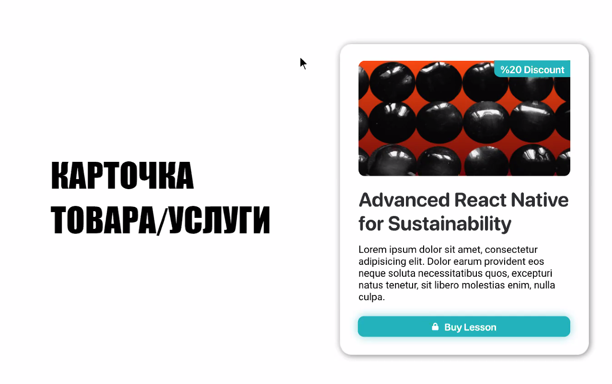

```html
<article class="card">
  <h2>
    <a href="#">Title</a>
  </h2>
  <div class="img_wrap">
    
    <div>label</div>
  </div>
  <p>Text text text text</p>
  <a href="#"></a>
</article>
```

- для поисковика важнее в начале расположить title, потом картинку и другой текст. Потом стилями, можно картинку расположить на первое место
- `span` - это семантически нейтральный элемент, а `p` - текст, связанный с заголовком и т.д. Если есть просто текст (как описание товара, например) лучше всего расположить его в `p`
- если лейбл (как скидка на картинке) не важен для контекста, то лучше расположить его в псевдоэлементе (`:before` или `:after`). Поисковый бот будет сканировать всё, что касается артикла, по этому ненужный текст, лучше оставить в стилях, которые поисковый бот не видит
- у `article` должен быть заголовок, у `section` допускается отсутствие заголовка
- в данном случае "скидка" важна для скринридеров, но не нужна для СЕО. Тут нужно делать выбор в сторону того, что больше нужно с точки зрения задачи.

### Футер сайта

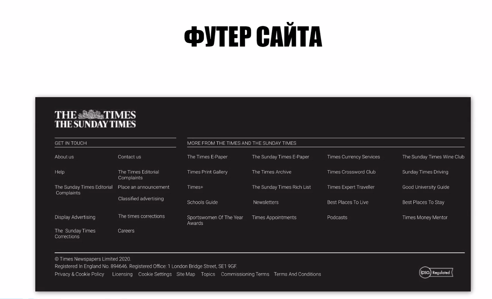

```html
<footer>
  
  <section>
    <h2>Text</h2>
    <nav>
      <ul>
        <li><a href="#">item</a></li>
        <li><a href="#">item</a></li>
        <li><a href="#">item</a></li>
        <li><a href="#">item</a></li>
        <li><a href="#">item</a></li>
        <li><a href="#">item</a></li>
        <li><a href="#">item</a></li>
        <li><a href="#">item</a></li>
        <li><a href="#">item</a></li>
        <li><a href="#">item</a></li>
      </ul>
    </nav>
  </section>
  <section>
    <h2>Text</h2>
    <nav>
      <ul>
        <li><a href="#">item</a></li>
        <li><a href="#">item</a></li>
        <li><a href="#">item</a></li>
        <li><a href="#">item</a></li>
        <li><a href="#">item</a></li>
        <li><a href="#">item</a></li>
        <li><a href="#">item</a></li>
        <li><a href="#">item</a></li>
        <li><a href="#">item</a></li>
        <li><a href="#">item</a></li>
        <li><a href="#">item</a></li>
        <li><a href="#">item</a></li>
        <li><a href="#">item</a></li>
        <li><a href="#">item</a></li>
        <li><a href="#">item</a></li>
        <li><a href="#">item</a></li>
        <li><a href="#">item</a></li>
        <li><a href="#">item</a></li>
        <li><a href="#">item</a></li>
        <li><a href="#">item</a></li>
      </ul>
    </nav>
  </section>
  <section>
    <div class="left">
      <p>Times Newspapers...</p>
      <address>Registered in England...</address>
      <!-- Если надо имейл -->
      <a href="mailto:google@gmail.com">google@gmail.com</a>
      <!-- если надо телефон -->
      <a href="tel:+38403984903">38403984903</a>
      <nav>
        <ul>
          <li><a href="#">item</a></li>
          <li><a href="#">item</a></li>
          <li><a href="#">item</a></li>
          <li><a href="#">item</a></li>
          <li><a href="#">item</a></li>
          <li><a href="#">item</a></li>
        </ul>
      </nav>
    </div>
    <div class="right">
      <a href="#">
        
      </a>
    </div>
  </section>
</footer>
```

- чем больше вложенность кода - тем больше его специфичность.

# Простые правила разметки

## `header`

Правильно рамзечать секции исходя из их значения. Например, `header` группирует контент, который не нужен для раскрытия основного контента секции, но при этом прямо с ним связано. Типичные представители такого контента это: заголовок, навигация по материалу - содержание, рейтинг и т.д. В некоторых случаях, когда контент прямо связано с личностью автора, например блог пост, имя автора так же может быть в `header`.

**Note!** Когда пойдёте читать документацию на _MDN_ лучше читать на английском, потому что этот контент чаще обновляется и не ломает вёрстку.

## `footer`

`footer` - эквивалентент `header` с той разницей, что группирует контент, который не имеет прямого отношения к основному в секции.

Примеры такого контента:

- лицензионное соглашение
- контактные данные
- автор
- дата написания материала
- диаграммы
- примечания

## `nav`

`nav` - секция, которая должна группировать только элементы навигации

## `article`

`article` представляет самостоятельную часть документа, страницы, приложения или сайта, предназначеную для независимого распространения или повторного использования. Этот элемент может представлять статью на формуе, статью в журнале или газете, запись в блоге или какой-либо другой самостоятельный фрагмент содержимого.

## `section`

`section` представляет собой автономный раздел - который не может быть представлен более точным по семантике элементом - внутри HTML-документа.

## `address`

`address` - указывает, что вложенный в него HTML-код предоставляет контактную информацию для человека или людей или для организации.

## Муки выбора тега

`article` это логическое ИЛИ, а `section` это логическое И. Если у вас ситуация, где на странице будет _один_ блок **ИЛИ** _другой_, то подходит `article`. Если на странице нужен и _один_ блок **И** _другой_

`ul` или `ol`? `ul` - _unordered list_ - список без нумерации. Если порядок айтемов не важен - оборачиваем в него. Если порядок важен (даже если не нужные именно цифры нумерации (например порядок ссылок в дереве страниц сайта)), то используем `ol` чтобы порядок всегда сохранялся.

`b` или `strong`? Они оба делают текст более жирным, но с точки зрения семантики в тег `b` стоит оборачивать слова, на которых мы хотим сделать акцент. А в `strong` нужно оборачивать какую-то осмысленную фразу.

То есть

```jsx
<strong>Ремонт бытовой техники в Киеве</strong>
<b>Ремонт</b> бытовой техники в <b>Киеве</b>
```

`i` или `em`? `i` - для определённых слов, как `strong`.

# Валидация

Нужно проверять свой код на предмет валидации html в специальных сервисах

# Проверка вложенности

[Can I Include](https://caninclude.glitch.me/)

Тут можно проверить возможно ли вложить один блок в другой. Пример проблемы: нельзя вкладывать один интерактивный элемент в другой (например кнопку в ссылку).

# Подходы к разработке

## Mobile-first

Первым делом разрабатываем мобильную версию приложения, потом планшетную, а потом десктопную. Имеет смысл делать graceful degradation.

## Desktop-first

Первым делом разрабатываем десктопную версию приложения. Потом по надобности делаем мобильную версию.

## Graceful Degradation

Это тип разработки, когда если отваливается JavaScript на сайте, пользователю предоставляется возможность минимальных взаимодействий с контентом (например, равзорачиваение менюшек на инпутах (как в popup-task)). Или, если упор на пользователей мобильных браузеров, нужно сделать так, чтобы если отвалится css, весь контент был доступен для взаимодействия на странице.

## Progressive enhancement

Подход обратный graceful degradation - когда сначала делаем минимальный функционал, и когда он готов делаем всё через javascript и т.д.

# Генератор HTML дерева

Тут можно посмотреть детальнее про структуру вашего HTML кода.

[Генератор HTML-дерева](https://yoksel.github.io/html-tree/)

# Q&A

_Вопрос_

> По поводу тегов `data` ?

_Ответ_

> _(Плохо слышно было, ответ немного про другое сначала)_ Тег `time`используется для указания даты. Например когда была создана статья на сайте с новостями. Если указывать верно время в аттрибуте `datetime` (в милисекундах (например `<time datetime="2001-05-15 19:00">15 мая</time>`)), то поисковые роботы хорошо к этому относятся.

Тег `data` можно использовать когда это действительно нужно, но это лишняя нода в дереве, если сайт сложный, то это усложняет и замедляет рендер.

---

# CSS

CSS - cascade style sheets - каскадные таблицы стилей - формальный язык описания внешнего вида документа (веб-страницы), написанного с использованием языка разметки (чаще всего html или xhtml). Также может применяться к любым xml-документам.

# Блочная модель

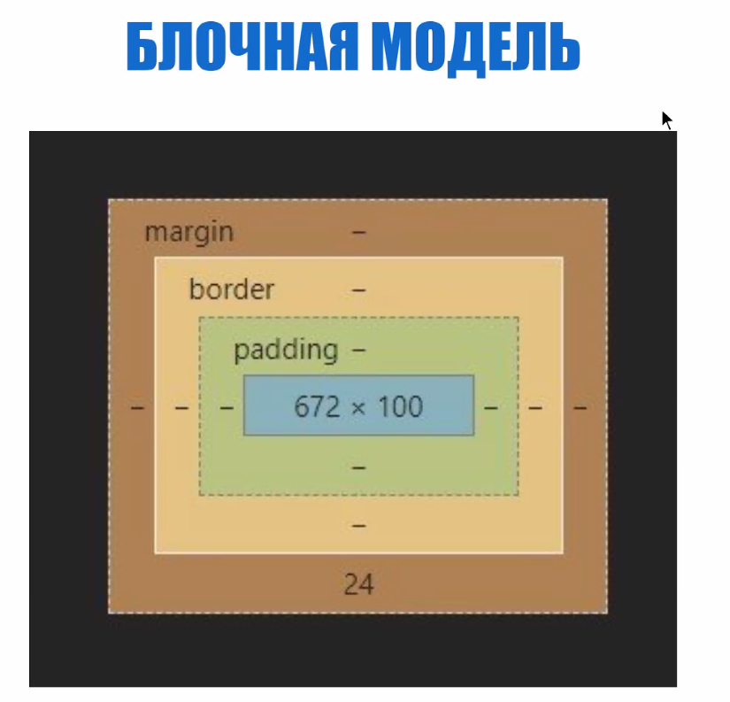

У элементов есть параметр `box-sizing` и по умолчанию он установлен в `content-box`. Это значит что если мы укажем ширину элементу `672` это будет значить что это ширина именно контента. К нему потом добавляются отступы, границы и т.д. Если установить `box-sizing: border-box`, то ширину мы будем указывать включая все дополнительные размеры элемента, а ширина контента будет формироваться и оставшегося значения общей ширины элемента.

```html
<div class="block"></div>
```

В таком случае ширина элемента будет 300 пикселей. Если мы добавим элементу `padding`. То его размеры увеличатся, потому что `padding` добавится к размерам `width` и `height`.

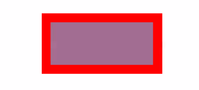

```css
.block {
  width: 300px;
  height: 150px;
  background-color: red;
  margin: 50px auto;
}
```

Если же мы добавим

```css
box-sizing: border-box;
```

То ширина нашего элемента всегда будет `300px`, просто контент уменьшится, заняв всё пространство оставшееся после `width` - `padding`.

# Блочных и строчных элементов в HTML **больше нет**!

Раньше были такие понятия как _строчный_ и _блочный_ элемент. Согласно новой спецификации, есть такие типы тегов:

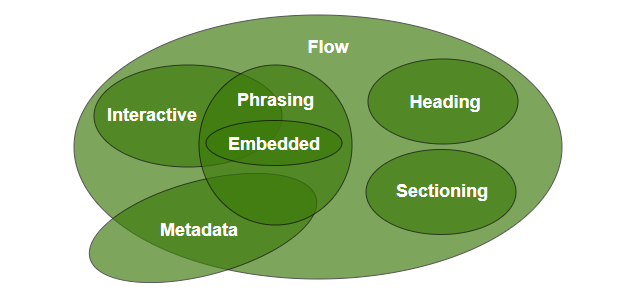

- Metadata content
- Flow content
- Sectioning content
- Heading content
- Phrasing content
- Embedded content
- Interactive content

## Metadata content

Тут мы имеем информацию _о странице_. Такая информация как язык страницы, подключаемые стили, скрипты, шаблоны и т.д. находятся в метатегах.

## Flow content

Это теги, в которых хранится сам контент: ссылки, блоки, формы, шапки, подвалы и т.д.

## Section content

Теги для разделения контента: секции, артиклы и т.д.

**Note!** тег `aside` не учитывается поисковиком. Можно, например, обернуть в него рекламный баннер.

## Heading content

Заголовочные теги

## Phrasing content

Теги, которые представляют собой непосредственно текст с минимальной вложенностью - параграфы, кнопки, ссылки и т.д.

## Embedded content

Позволяют использовать встроенный контент: `iframe`, `canvas` и т.д.

## Interactive content

Элементы, с которыми можно взаимодействовать: кнопки, ссылки, поля для текста, чекбоксы и т.д.

# Стандартные стили

В браузере предустановлены встроенные наборы стилей. Часто они нам не нужны, по этому их нужно либо сбрасывать либо перебивать своими значениями. Для этого придумали ресеттеры.

## RESET.CSS

При подключении этих стилей - все отступы, декорации и прочее отключаются и мы работаем с нулевыми значениями.

## NORMALIZE.CSS

Тут подход немного другой. Эти стили выравнивают все отступы внутри всех браузерах, чтобы они были одинаковые. То есть отступы остаются, но они одинаковые для всех браузеров.

**Note!** reset.css давно не обновлялся (~ 7 лет)

**Note!!** Хорошей практикой является написание стилей в определённом порядке:

1. позиционирование
2. `box-sizing`, `display`
3. отступы
4. свойства, которые влияют на размеры, размер шрифта и т.д.
5. "украшательства", фон, тени и т.д.

Это нужно, чтобы потом не терятся в описаниях стилей элементов, у которых много правил.

# Наименования классов

Список частоиспользуемых слов для названий классов:

[yoksel/common-words](https://github.com/yoksel/common-words)

Если код имеет слишком много вложености, например в SASS, то есть смысл задумываться о его разбитии. Помощь:

[SassMeister | The Sass Playground!](https://www.sassmeister.com/)

# Специфичность селекторов

Приоритет:

1. Инлайновые стили `inline style=""`
2. Стили по идентификторам `#id`
3. Стили по классам и аттрибутам `.class`
4. Теги и псевдоклассы

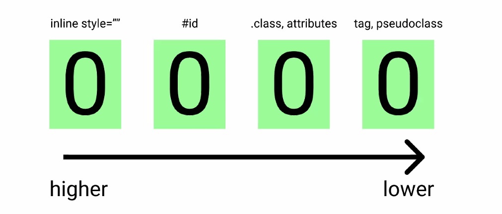

После того как мы делаем какой-то селектор, по схеме выше мы получаем число. У какого селектора число больше - тот и применяется.

Если специфичность одинаковая, то приоритет имеет тот селектор, кто в коде написан нижен.

```html
<head>
  <style>
    #summary {
      color: red;
    }
  </style>
</head>

<body>
  <p id="summary" style="color: blue">content</p>
</body>
```

```css
p {
  margin: 50px auto;
  width: 100px;
  font-size: 45px;
}
```

Лучше не писать стили прям в элементе, а выносить их в css стили. Исключение только вёрстка html-писем, они открываются не в браузере, а в клиентах, там ограниченые теги и нельзя подключать стили. Нужно будет писать всё в элементах или в теге `style` внутри `head`.

## !important

Директиву `!important` лучше всего не использовать. Она имеет наиболее большой приоритет и если нужно использовать её, то это только в крайнем случае.

## Калькулятор специфичности

[Specificity Calculator](https://specificity.keegan.st/)

## Излишняя вложенность

Не стоит делать лишнюю вложенность вообще нигде. Это слишком усложняет читаемость кода. Рекомендуется вложенность не больше 3х уровней.

Пример хорошего использования сложенности: например у вас есть кнопка, вы описали её стили и можно вложить стили её состояний - активного, нажатого и т.д.

# Q & A

_Вопрос_

> Анимацию лучше писать на CSS или JS?

_Ответ_

> Зависит от анимации. Если это простенькая анимация появления или исчезания или чего-то такого, то лучше делать это на CSS. Так же лучше всего использовать `transform`и `opactity`чем позиционирование, потому что они считаются на видеокарте и это позволяет разгрузить процессор. Сложные анимации - JS.

---

_Вопрос_

> Нормально ли использовать Бэм?

_Ответ_

> Нужно уточнять у команды разработчиков проекта, в который вы приходите. Если там используют БЭМ - используйте и вы.

---

# Сетки

Изначально люди использовали то, что было доступно - таблицы. На таблицах использовали всё, было просто формировать позиционирование большого количества контента.

_Пример того что было раньше:_

```html
<table cellpadding="0" cellspacing="0" width="860" align="center">
  <tr>
    <td colspan="3" class="header">Мой сайт</td>
  </tr>
  <tr>
    <td class="left_col">Меню</td>
    <td class="center_col">Содержание</td>
    <td class="right_col">Ссылки</td>
  </tr>
  <tr>
    <td colspan="3" class="footer">&copy; Все права защищены</td>
  </tr>
</table>
```

_Одна из причин популярности такой разметки - обширная поддержка в браузерах:_

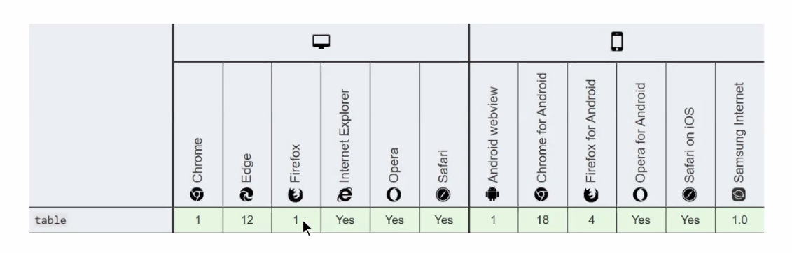

## Float

На смену таблицам пришёл `float`. Он позволил размещение элементов перенести в стили, а в структуре оставить только структуру. Но есть проблема с тем, что элементы для которых применён `float` выпадают из потока элементов и нужно использовать clearfix. Сейчас он используется только для обтекания текстом.

## inline-box

На смену `float` пришёл `inline-block`. С ними тоже есть нюансы, вроде ненужных отступов и прочего. Можно починить сбрасыванием у родительского элемента размера шрифта (нужно установить его в 0), потому что проблема возникает из-за невидимого символа окончания строки в конце каждого `inline-block` элемента. Но с этим тоже нужно быть осторожным.

Почитать про то, где использовать `inline-block` сейчас можно тут:

[When do you use inline-block? | CSS-Tricks](https://css-tricks.com/when-do-you-use-inline-block/)

## Flex

Бесплатный курс:

[What The Flexbox?!](https://flexbox.io/)

Основной концепт:

Существует 2 оси, относительно которых распологаются элементы:

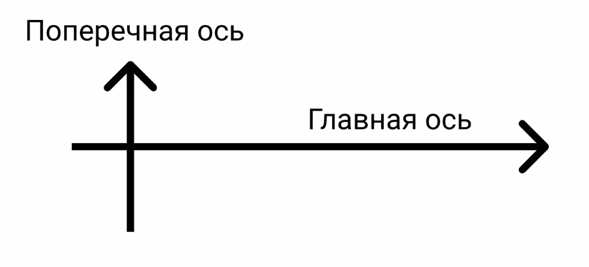

`flex-direction: column` просто переворачивает эту сетку координат:

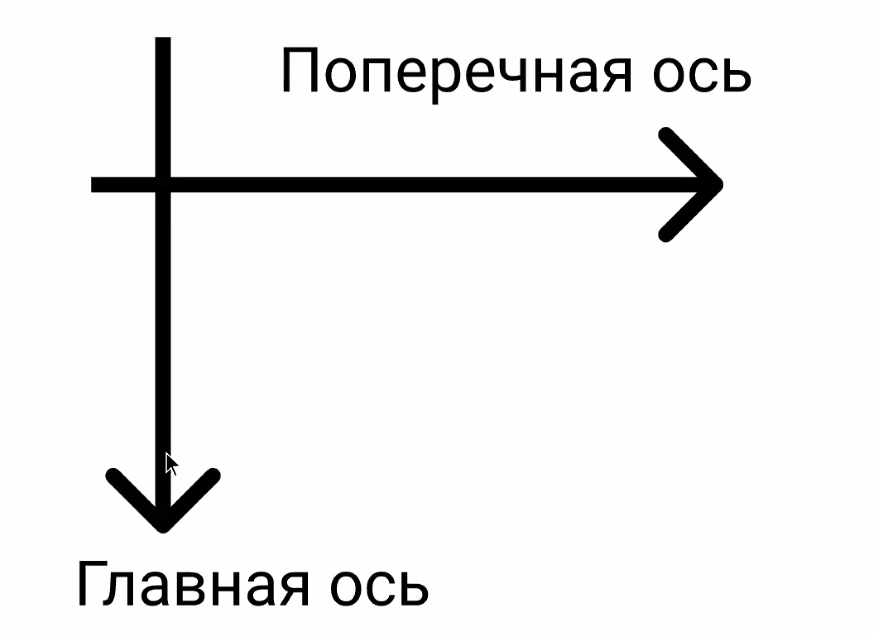

В таком случае `justify-content` и `align-items` меняются ролями.

```html
<div>
  <div class="block_item"></div>
  <div class="block_item"></div>
  <div class="block_item"></div>
  <div class="block_item"></div>
  <div class="block_item"></div>
  <div class="block_item"></div>
  <div class="block_item"></div>
  <div class="block_item"></div>
  <div class="block_item"></div>
</div>
```

```css
.block {
  margin: 20px auto;
  max-width: 700px;
  width: 100%;
  background: rgba(green, 0.5);
  display: flex;
}

.block_item {
  min-width: 100px;
  max-width: 200px;
  height: 50px;
  background: red;
  border: 2px solid black;
}

.block_item:nth-of-type(5) {
  height: 100px;
}
```

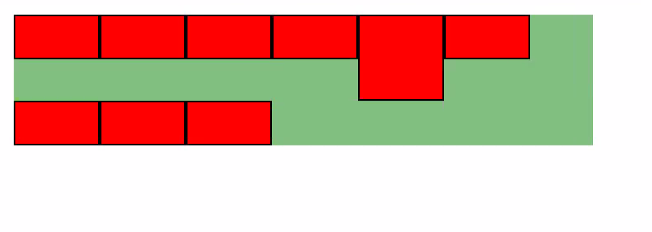

_Высота строки всегда зависит от самого высокого элемента в этой строке_

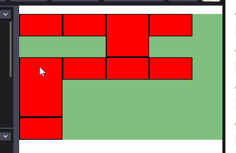

_Даже при переносе_

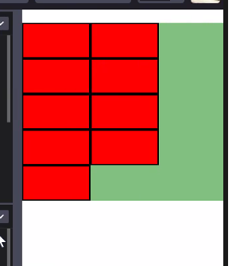

_Элементы переносятся на новую строку в зависимости от размера родительского элемента_

## Grid

Решают проблемы с тем, что у флексбокса только одна рабочая ось.

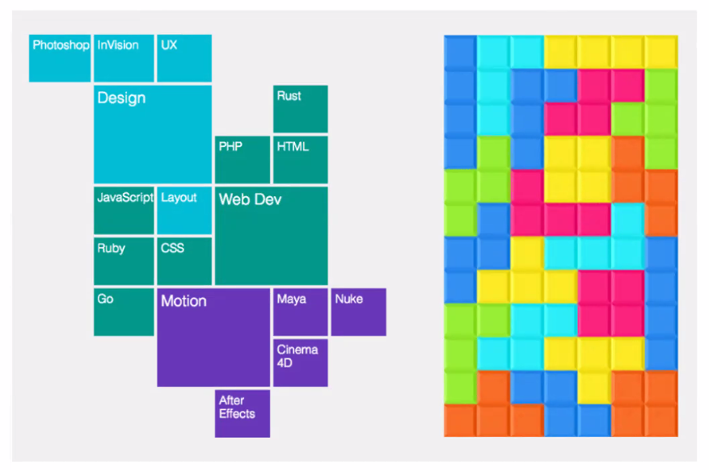

Когда мы даём `display: grid` для родительского элемента, все его дочерние элементы становятся ячейками.

[Things I've Learned About CSS Grid Layout | CSS-Tricks](https://css-tricks.com/things-ive-learned-css-grid-layout/)

```html
<div id="container">
  <div class="el">ONE</div>
  <div class="el">TWO</div>
  <div class="el">THREE</div>
  <div class="el">FOUR</div>
  <div class="el">FIVE</div>
  <div class="el">SIX</div>
  <div class="el">SEVEN</div>
  <div class="el">EIGHT</div>
  <div class="el">NINE</div>
  <div class="el">TEN</div>
</div>
```

```css
#container {
  color: white;
  background-color: lightgray;
  font-family: sans-serif;
  display: grid;
  grid-template-columns: repeat(5, 1fr);
}

.el {
  padding: 1.5rem;
  background-color: dimgray;
  border: 1px darkgray solid;
}
```

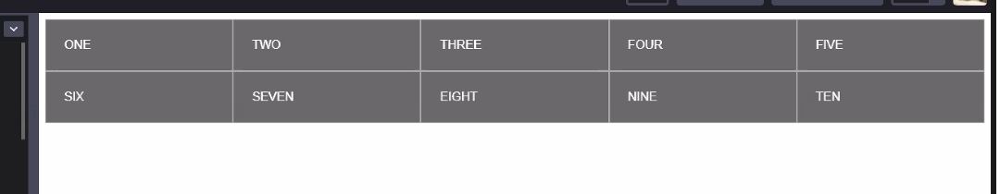

`grid-gap` отступы

Можно использовать свойство `gap` - работает и во флексах и в гридах.

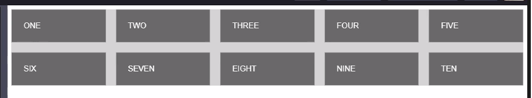

_После добавления gap_

Можно так же использовать внутри`repeat()` - `autofit, minmax(100px, 250px)`


Запись выше подразумевает что ширина колонки будет в пределах `100px` и `250px`.

Вместо `auto-fit` можно написать `auto-fil`. В таком случае элементы будут автоматически занимать всё доступное пространство.

Сайт-шпаргалка на примерах:

[Grid by Example](https://gridbyexample.com/)

## Q & A

_Вопрос_

> Подскажите, пожалуйста, как часто в вашей текущей практике встречается необходимость поддержки старых браузеров?

_Ответ_

> Зависит от конкретной работы. Нужно смореть какими браузерами пользуется целевая аудитория продукта.

---

_Вопрос_

> Bootstrap в 2021

_Ответ_

> Большой плюс бутстрапа заключается в том, что из него выпилили jQuery. Является простеньким инструментом, когда нужно быстро набросать что-то или протестировать прототип. Всё упирается в то, что вы будете делать и для чего.
