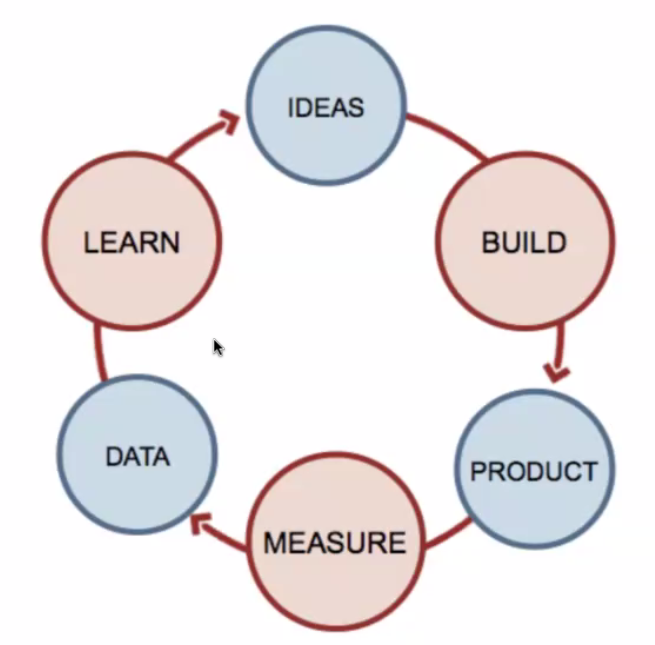

# Лекция 13. MVP & Friends. Основа приложения. v1.0

[Назад](../../README.md)

# Структура занятия

- MVP - что, как и почему
- Примеры MVP больших компаний
- Больше о методологии Lean Startup
- Weather app features, д/з
- Практика

# MVP

Минимально жизнеспособный продукт (minimum viable product, MVP) - продукт, обладающий минимальными, но достаточными для удовлетворения первых потребителей функциями.

## Почему MVP?

Получение обратной связи для формирования гипотез дальнейшего развития продукта.

Сбор информации от MVP зачастую дешевле, чем разработка продукта с большим количеством функций. Это позволяет снизить затраты и риски, если продукт не заработает, например, из-за неверных предположений.

Простыми словами, MVP нужен чтобы "прощупать" насколько данный продукт вообще полезен его целевой аудитории и при этом чтобы не потратить на продукт слишком много.

## Цели MVP

- Уметь проверить гипотезу продукта с минимальными ресурсами
- Ускорить обучение, получение опыта и данных
- Сокращение затраченных инженерных часов
- Как можно скорее получить продукт для ранних клиентов
- Основа для других продуктов
- Создание способности разработки продукта

Все продукты делятся на два подтипа:

- лекарства, которые решают какую-то проблему
- витаминки, которые не решают конкретную проблему, но помогают жить (или развлекают)

# Примеры

## Uber

В первоначальной версии приложения у Uber были лишь функции соединения водителей с клиентами, а также оплаты.

Эта простота и позволила Uber добиться успехов на рынке, получить множество данных для анализа, привлечь инвестиции и постепенно создать многомиллиардный бизнес.

Сегодня у Uber куда более сложное мобильное приложение с системой поддержки по всему миру.

## Snapchat

Первая базовая концепция Snapchat - быстрый сервис для обмена сообщениями и изображениями, где весь контент удалялся через 10 секунд после прочтения.

Первая iOS-версия приложения была запущена в 2011 и из продвинутых функций включала в себя только загрузку изображений.

По состоянию на 2020 год, у Snapchat уже более 265 миллионов активных пользователей ежедневно.

## Foursquare

MVP приложения от Foursquare в самом начале содержало лишь возможность "чекиниться", а так же награды за достижения пользователей в виде значков.

После сбора обратной связи от пользователей разработчики приложения начали разширять его возможности. Они добавили рекомендации и путеводители по городам.

В настоящий момент сервис имеет 1 миллиард пользователей, отметивших своё местоположение больше 8 миллиардов раз.

## Онлайн платформа для активизма

В течении года было потрачено на компанию 1 миллион долларов и ничего с ней не происходило. В итоге они сделали WordPress блог, загружали туда купоны и вручную отправляли их людям. Это привело к созданию Groupon.

## Burbon

Было сложным приложением, где юзеры могли "чекиниться" в их локации. Люди не использовали многие фичи, а просто делились фотографиями. Разработчики упростили приложение и сфокусировались на фото, так получился Instagram.

## Сайт с видео свиданиями

Никто не загрузил ни одного видео. Забыли про концпет свиданий и дали просто загружать видео. Так получился YouTube.

# MVP как часть Бережливого стартапа

1. Появляется идея
2. Строим её
3. Получается продукт
4. Измеряем его
5. Получаем данный о продукте
6. Изучаем данные
7. (1) Появляются идеи...

Главное - заставить этот цикл происходить всё быстрее и быстрее, чтобы ускорить развитие проекта.

Бережливый стартап (Lean Startup) - концепция создания компаний, разработки и выведения на рынок новых продуктов и услуг, основання на таких понятиях, как:

- научный подход к менеджменту стартапов
- подтвержденное обучение
- проведение экспериментов
- итеративный выпуск продуктов для сокращения цикла разработки
- измерение прогресса
- получение ценной обратной связи от клиентов

# Weather app features

- Показать погоду на сегодня в конкретном городе
- Показать прогноз погоды на ближайшие 5 дней
- Поиск по городам
- Показывать температуру в разных системах исчисления (metric / imperial)
- По геолокации показывать погоду на сеогдня и прогноз в месте нахождения пользователя
- Показ погоды в городах из списка пользователя
- Мультиязычность приложения

# Следущий шаг в Домашнем задании

1. Взять 3-4 первые фичи из вашего списка, отсортированного по убыванию важности.
2. Придумать для них общий UI и написать реализацию (MVP) приложения на чистом JS, используя компонентный подход.

Пример интерфейса для Weather app:

# Практика

[https://github.com/kottans/framework-2021](https://github.com/kottans/framework-2021)

Файлики брать отсюда:

[https://github.com/kottans/framework-2021](https://github.com/kottans/framework-2021)
