# Лекция 2. Графика в интернете, А11Y и формы, работа с контентом

Лектор: Александр Островной
Модуль: HTML/CSS JS DOM

[Назад](../../README.md)

# Содержание

# Графика в вебе

В среднем по статистике около 60-70% веса сайта - это графика.

Существует 2 типа графики:

- растровая
- векторная

## Растровая графика

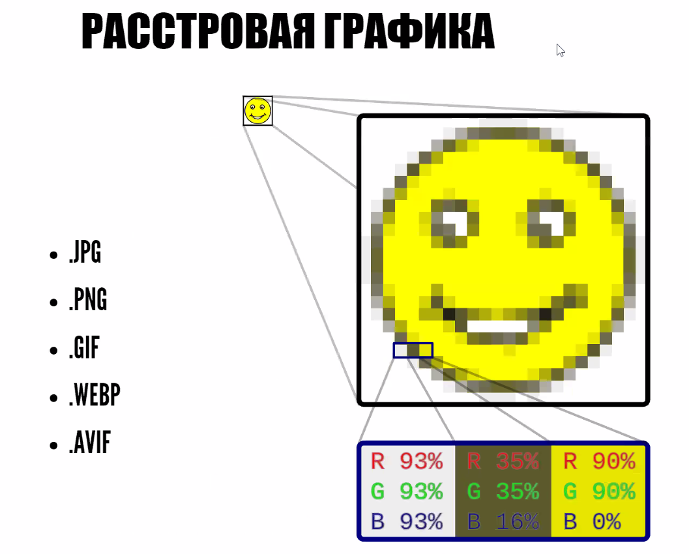

Растровая графкиа состоит из пикселей, каждый из которых имеет свой цвет. Недостатком является то, что при увеличении - будет видно все эти пиксели, то есть они масштабируются с картинкой.

Популярные форматы:

- jpeg
  он позволяет неплохо сжимать, но у него нет прозрачности
- png
  вес больше чем у jpeg, но есть прозрачность
- gif
  поддерживает анимации, но весит много. Так же поддерживает только 256 цветов
- webp
  новый формат, который разработан Google
- avif
  более современный формат, сейчас на него делается основная ставка на будущее развитие

## Векторная графика

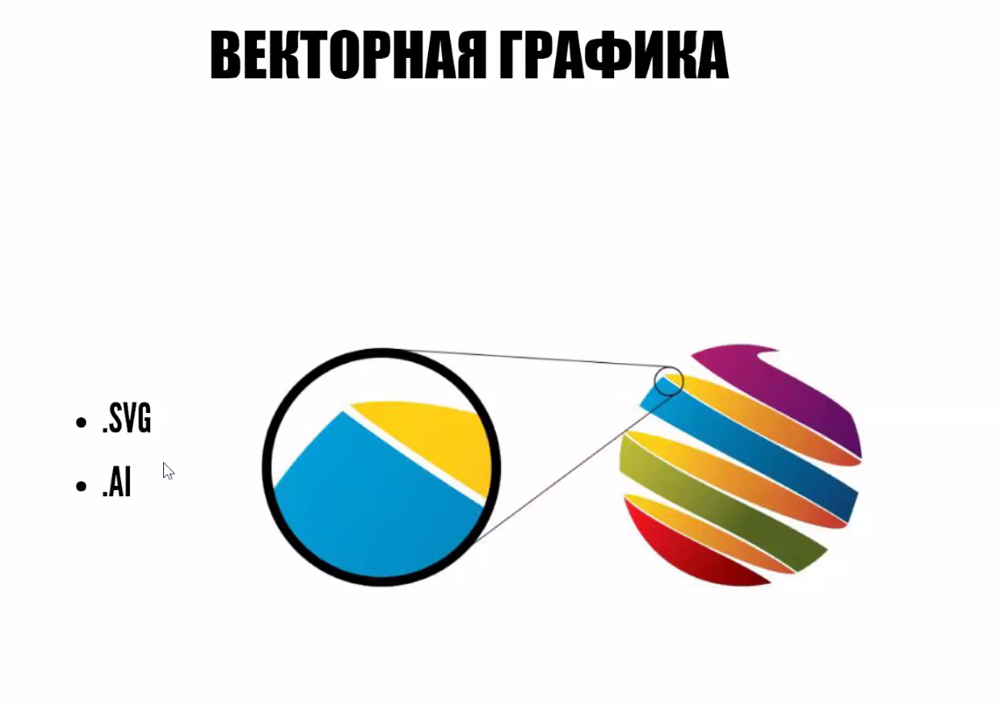

Векторная графика создаётся методом математических форм - отрезков, кривых, окружностей и т.д. Из-за этого она весит сильно меньеше растровой графики и её можно бесконечно масштабировать, так как всё высчитывается в пропорциях.

## Растр vs Вектор

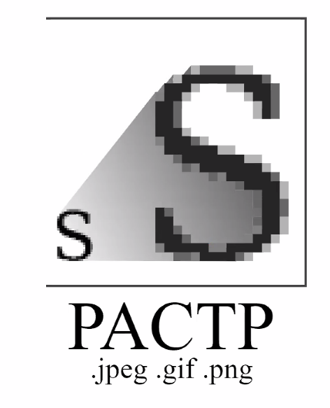


Растр используется часто для контентных изображений - фото товаров, иллюстрации, лого и т.д.

Вектор используется для декоративных изображений - иконки, кнопки и т.д. Они не несут самостоятельный смысл, а украшают сайт.

## Добавление картинок в html

Изображения на страницу можно добавить разными способами

### Элемент img

Как самостоятельный html элемент:

```html

```

Самостоятельным элемент. Изначально имеет размер картинки, которую подключаем

### Свойство background-image

Как стили в CSS:

```css
background-image: url("../../media/examples/star.png")
  url("../../media/examples/lizard.png");
```

Зависит от размера блока, но можем добавить несколько картинок.

### Аттрибут srcset

Раньше мы просто добавляли большую картинку и меняли её до размера, который нам нужен. Сейчас это плохо, по этому есть требование делать так, чтобы пользователь не тратил траффик в пустую и скачивал картинку ровно того размера, который требуется. Можно делать так:

```html

```

`srcset` позволяет использовать разные пути для разных условий (например для ширины, как тут).

**Важно!** Нужно оставлять в `src` ссылку на самую большую картинку. Потому что поисковый робот берёт и выводит в результатах поиска по картинкам те, которые больше.

Так же, по мимо ширины (`500w`, `1200w`...) можно использовать плотность пикселей - `1x`, `2x`.

### Элемент picture

Относительный новый элемент. Можем использовать несколько источников, а так же указывать условия при которых будет выбираться тот или иной источник. Обязательным является написание тега `img`. Его минус перед просто использованием `img` является тем, что он добавляет ещё один DOM элемент. Если картинок на сайте много - нужно задуматься - а стоит ли использовать `picture`? Плюс заключается в том, что можно комбинировать условия.

```html
<picture>
  <source type="image/avif" scrset="img/img.avif" />
  <source
    media="(-webkit-device-pixel-ratio: 2) and
		(-webkit-min-device-pixel-ratio: 2) and (-webkit-max-device-pixel-ratio: 2.99),
		(min-resolution: 2dppx) and (max-resolution: 2.99dppx)"
    srcset="img/cat2_1000.jpg"
  />
  <source
    media="(min-width: 768px) and (max-width: 1499px)"
    srcset="img/cat2_1000.jpg"
  />
  
</picture>
```

### Элемент figure

В основном используется в статьях, когда нужно добавить изображение и к нему подпись. Но нужно учитывать, что картинки очень влияют на поисковых роботов. Нужно аккуратно пользоваться с подписями, потому что если Google посчитает, что ваша подпись не подходит к картинке, то он может понизить ваш сайт в поисковой выдаче. Но при этом правильная подпись наоборот, может поднять сайт в поисковой выдаче. Так же нужно учитывать что `alt` не должен сильно отличаться от контента.

```html
<!-- Just an image -->
<figure>
  
</figure>

<!-- Image with a caption -->
<figure>
  
  <figcaption>MDN Logo</figcaption>
</figure>
```

### Свойство image-set

Теперь ещё есть новое CSS свойство, которое работает как `srcset`:

```css
background: image-set(
  "../img/cat_1x.jpg" 1x,
  "../img/cat_2x.jpg" 2x,
  "../img/cat_3x.jpg" 3x
);
```

### Изображения в avif

Это важный и доминирующий в плане сохранения качества изображения при сжатии формат на данный момент. Посмотреть лично можно тут:

[AVIF has landed](https://jakearchibald.com/2020/avif-has-landed/)

## Lazy loading

```css

```

Суть в том, что при этом значнии аттрибута картинка будет загружаться только в момент, когда картинка попадает в обласить видимости пользователя. Минус в том, что если картинка много весит, то он будет долго подгружаться, хотя мы уже будем видить её, что не очень хорошо. Иногда, вместо этого используют js, чтобы загружать картинку за некоторое время ДО того, как она оппадёт в область видимости.

Реализация на JS:

[Lazy-loading images](https://web.dev/lazy-loading-images/)

Недостаток только в том, что технология довольно новая, не везде есть поддержка, нужно проверять.

## Cumulative Layout Shift

Это явление, когда ваш сайт сдвигается вниз, потому что какой-то контент (картинки, например) подгрузились выше и сдвинули весь контент. Это очень плохо, т.к. пользователь может промахнуться по кнопке, потому что сайт съехал. Чтобы избегать такое поведение - нужно задавать картинке `width` и `height` чтобы она заранее резервировала место.

Статья:

[Cumulative Layout Shift (CLS)](https://web.dev/cls/)

## Aspect Ratio

Для сохранение пропорций картинки раньше был лайфхак:

```html
<div class="block">
  <div class="inner"></div>
</div>
```

Так мы сохраняем пропорции при помощи "padding-lock".

```css
.block {
  max-width: 500px;
  width: 100%;
  background-color: red;
}

.inner {
  width: 100%;
  height: 0;
  padding-bottom: 56.25%;
  background: blue;
}
```

Но недавно внесли новое CSS свойство для этого:

```css
.img {
  aspect-ratio: 16 / 9;
}
```

## Q & A

_Вопрос_

> Тип avif, если браузер не поддерживает этот тип, а в `picture` есть другие файлы ниже - браузер выберет тот что ниже?

_Ответ_

> Да, он выберет первый, который поддерживается и подходит под условия.

---

_Вопрос_

> Плотность пикселей зависит от устройства?

_Ответ_

> Да, например на телефоне, есть два вьюпорта, один физический и другой цифровой. Например, есть телефон с full hd экраном, но плотность пикселей там выше чем на десктопе с тоже full hd. Можно подробнее глянуть про разные размеры на mydevice.io:

[mydevice.io : web devices capabilities](https://www.mydevice.io/)

---

_Вопрос_

> Когда требуют Retina-ready дизайн, что делать с картинками?

_Ответ_

> В основном это значит, что каждая картинка будет у вас в двух экземплярах. Именно для Retina экранов будет отдаваться картинка с разрешением в 2 раза больше. Но при этом в самом сайте она должна занимать столько же места.

---

_Вопрос_

> Что такое картинки заглушки и как их использовать?

_Ответ_

> Это картинка, которая попадает во вьюпорт, пока основная картинки не успела загрузиться (например из-за lazy loading). Такие картинки резервируют место и показывают пользователю что _здесь что-то будет._ Так же можно использовать `background-color`, но тогда нужно будет задать ширину и высоту картинке, что может сломать размер самой картинки.

---

_Вопрос_

> Можно ли перевести jpg в svg?

_Ответ_

> Это называется трассировка и это сложно. Лучше так не делать, только в крайних случаях.

---

_Вопрос_

> Правильно ли я понимаю, что поисковый робот может понять разницу между подписью на картинке и контентом статьи? Зачем тогда вообще подписывать картинку, если есть `alt`?

_Ответ_

> Да, может. Подписывать нужно, потому что в подписи мы описываем ситуацию или какой-то контекст к картинке. А в `alt` мы описывам конкретно то, что находится на картинке. Так же, например, в умных часах есть особая отработка `figure` с `figcaption`, так что их использование улучшает пользовательский опыт для пользователей умных часов. Также если вы не хотите, чтобы подпись ранжировалась поисковыми роботами, добавляйте их в псевдоэлемент `after`.

---

_Вопрос_

> Как Google понимает какие картинки показывать, когда мы ищем картинки по тексту?

_Ответ_

> Он находит их по `alt` внутри картинки.

---

_Вопрос_

> Индексируется ли поисковикам `background-image`?

_Ответ_

> Нет. Только через html-элементы.

---

_Вопрос_

> Нужно ли обязательно каждую картинку оборачивать в `figure`? В каких случаях обязательно?

_Ответ_

> В основном это нужно только для картинок с подписями, например в статьях. Но это плюс один DOM-элемент и далеко не всегда нужно.

---

# HTML `<form>`

Элемент `form` представляет собой раздел документа, содержащий интерактивные элементы управления, которые позволяют пользователю отправлять информацию на веб-сервер.

Примеры форм:

```jsx
<form method="post">
	<label for="POST-name">Name:</label>
	<input id="POST-name" tyle="text" name="name">
	<input type="submit" value="Save">
</form>

<form>
	<label for="GET-name">Name:</label>
	<input id="GET-name" type="text" name="name">
	<input type="submit" value="Save">
</form>
```

## Кнопки отправки формы

По умолчанию, `button` отрабатывается как "отправить форму". Чтобы кнопка работала просто как кнопка, нужно добавлять ей `type="button"` в аттрибуты.

```jsx
<form action="">
	<button class="button" type="button">
	<button class="button">
</form>
```

В данном случае первая кнопка будет работать как обычная кнопка, а вторая будет работать как кнопка отправки формы.

## Разная внешность инпутов

В разных браузерах и системах разные инпуты выглядят абсолютно по разному, по этому им обычно задают собственные стили, а иногда вообще по своему реализовывают при помощи JS.

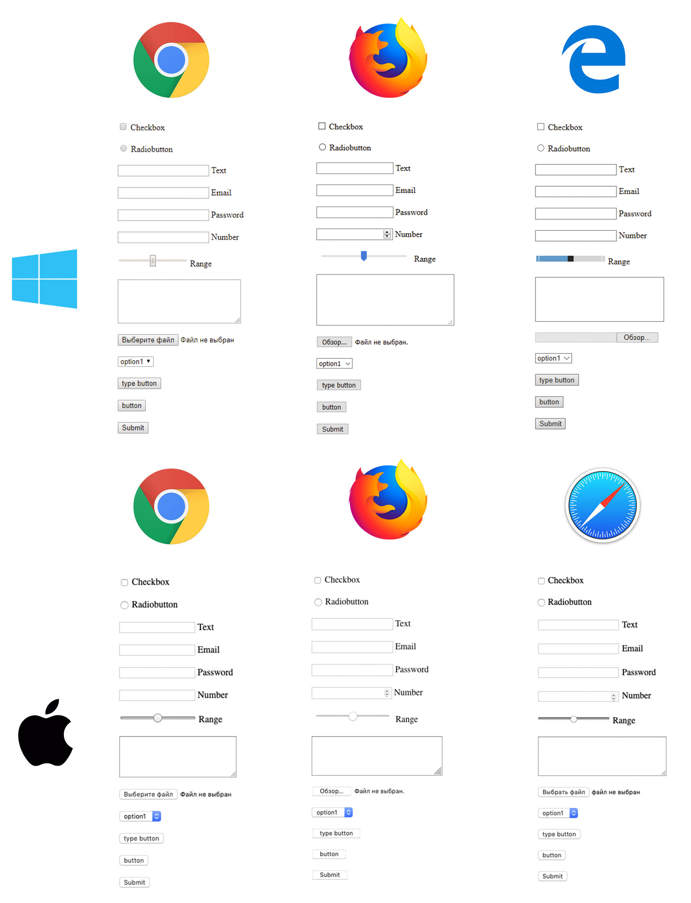

Разные инпуты:

```jsx
<input type="text" name="text" minlength="8" maxlength="16">

<input type="password" name="password" minlength="8" required>

<input type="email" name="email" pattern=".+@globex.com" size="10" required>

<input type="color" name="color">

<input type="range" name="range" value="0">

<input type="checkbox" name="checkbox" value="checkbox">

<input type="radio" name="radio" value="radio">

<input type="date" name="date">
```

## Нативная валидация инпута

У такой валидации есть минус - он заключается в том, что пользователю сразу высвечивается предупреждение о том, что что-то не так, хотя он даже не закончил писать. С другой стороны, это позволяет реализовать Graceful Degradation, если вдруг отвалится валидация - можно нативно показать, что что-то не так.

[https://codepen.io/a-ostrovnyy/pen/BvKebM](https://codepen.io/a-ostrovnyy/pen/BvKebM)

## Инпут для почтовых адресов

[https://codepen.io/a-ostrovnyy/pen/zyqQmK](https://codepen.io/a-ostrovnyy/pen/zyqQmK)

## Инпут для паролей

[https://codepen.io/a-ostrovnyy/pen/KbroWV](https://codepen.io/a-ostrovnyy/pen/KbroWV)

## Правильные типы инпутов

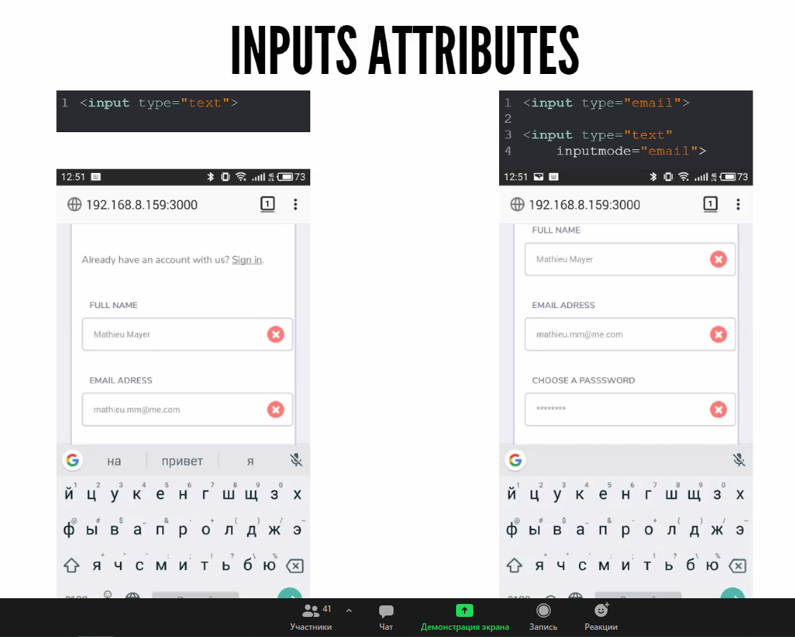

Дополнительные аттрибуты позволяют пользователям на мобильных устровах правильно показывать соответствующую клавиатуру (например с цифрами или со значком @).

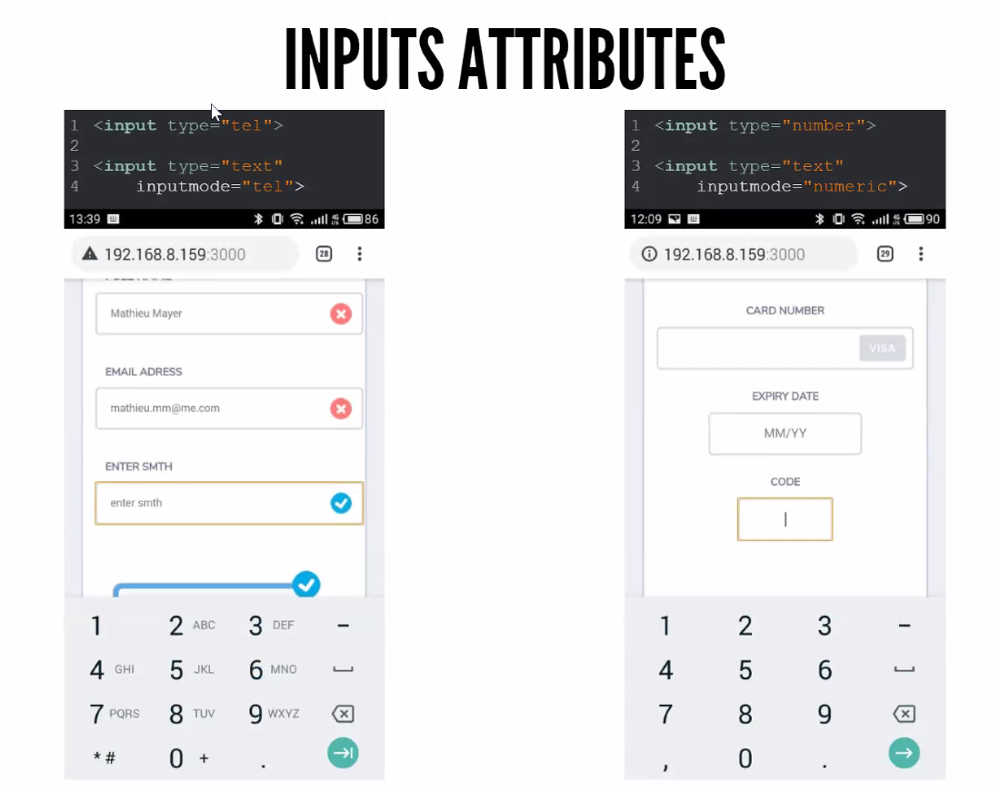

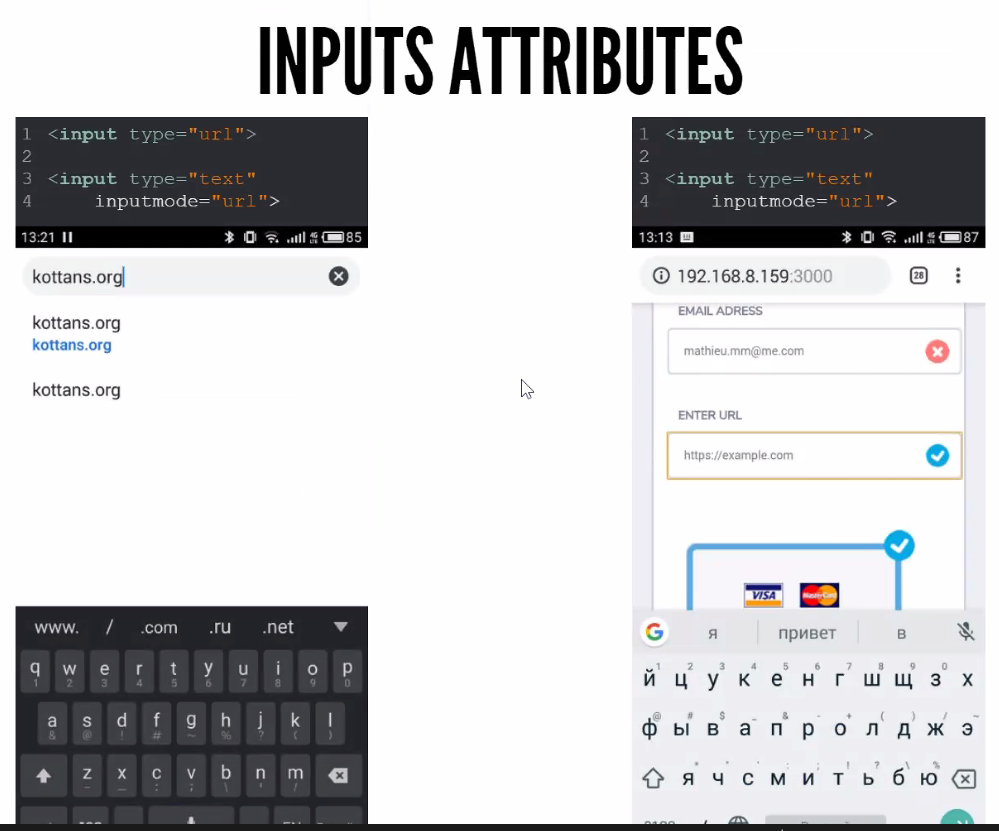

## Select

Один из самых сложных в плане реализации элементов. Стилизация довольно сложна, т.к. браузеры не позволяют стилизовать выпадающие варианты, только изначальную оболочку.

[https://codepen.io/a-ostrovnyy/pen/roaXVa](https://codepen.io/a-ostrovnyy/pen/roaXVa)

Если хотим стилизовать `select`, то это уже нужно делать вручную при помощи JS.

## Инпут для файла

[https://codepen.io/a-ostrovnyy/pen/VqYKoq](https://codepen.io/a-ostrovnyy/pen/VqYKoq)

## Радиокнопки

[https://codepen.io/a-ostrovnyy/pen/roNRyE](https://codepen.io/a-ostrovnyy/pen/roNRyE)

Чекбоксы - то же самое.

## Бегунки

[https://codepen.io/a-ostrovnyy/pen/zyGqQm](https://codepen.io/a-ostrovnyy/pen/zyGqQm)

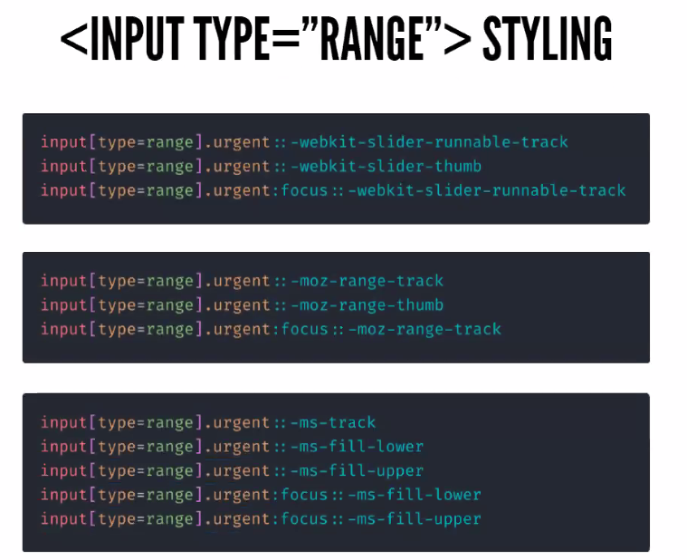

Примеры особых селекторов для разных браузеров.

runnable-track - полоска бегунка

thumb - сам бегунок

Т.к. нужно всё это делать отдеально для каждого браузера, многие часто просто создают кастомные слайдеры на JS.

## Q & A

_Вопрос_

> Можно пример кастомного select?

_Ответ_

> С точки зрения доступности лучше всего использовать стандартный select. Пример кастомного:

[https://codepen.io/druArt/pen/YVMQNX](https://codepen.io/druArt/pen/YVMQNX)

---

_Вопрос_

> Какие есть способы предотвращения массового сабмита форм?

_Ответ_

> Есть такая технология как debounce. Устанавливается таймер, например 1 секунда, и когда мы делаем запрос, следующий запрос не произойдёт раньше чем через одну секунду. Пример debounce:

```jsx
function debounce(fn, ms) {
  let timeout;
  return function () {
    const fnCall = () => fn.apply(this, arguments);

    clearTimeout(timeout);
    timeout = setTimeout(fnCall, ms);
  };
}
```

---

_Вопрос_

> Можно ли сделать так, чтобы форма не отправляла запрос, пока не пришёл ответ на предыдущий?

_Ответ_

> Да, нужно просто делать на promise.

---

_Вопрос_

> Для старых браузеров не поддерживается у некоторых `input` некоторые `type`. Как сделать правильно? Нужно сделать для всех через `pattern`? Или можно добавить оба варианта и показывать нужный в зависимости от браузера?

_Ответ_

> Начнём с того, что валидация всегда должна быть на бекенде. Это связано с безопасность. Валидация на фронтенде - это больше хороший тон для пользователя сразу показать что что-то не так. На неё полагаться не стоит. Лучше делать через `type`. Потом всё равно отловится всё валидацией на бекенде.

---

_Вопрос_

> Как делаются сейчас запросы?

_Ответ_

> По разному. Можно просто использовать `axios`.

---

# Доступность

В последнее время приобрела большую популярность и необходимость. Любой человек может подать в суд на любой сервис или сайт, если он не может по разным причинам прочитать информацию. По этому сейчас важно делать сайты _доступными_.

## Стандарты

Есть стандарты, например WAI-ARIA или WCAG.

[W3C Accessibility Guidelines (WCAG) 3.0](https://www.w3.org/TR/wcag-3.0/)

[WCAG 3 Introduction](https://www.w3.org/WAI/standards-guidelines/wcag/wcag3-intro/)

[WCAG 3 How-Tos](https://www.w3.org/WAI/GL/WCAG3/2020/how-tos/)

[Что нового в WCAG 3.0 - Веб-стандарты](https://web-standards.ru/articles/wcag3-changes/)

## Главные принципы доступности

- **Воспринимаемость** - люди должны иметь возможность воспринимать контент тем способом, который им доступен
- **Понятность** - контент и интерфейс должны быть понятны всем людям, в том числе и с инвалидность.
- **Управляемость** - люди должны иметь возможность взаимодействовать с интерфейсом и управлять контентом тем способом, который им доступен.
- **Надежность** - интерфейс должен оставаться доступным при изменении версий продукта или операционной системы.

## Типы ограничений

### Временные

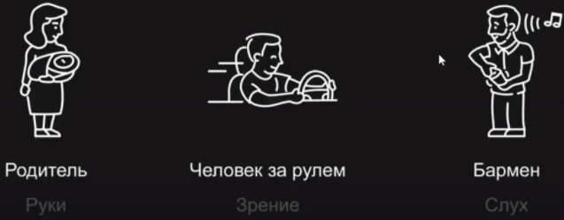

### Длительные

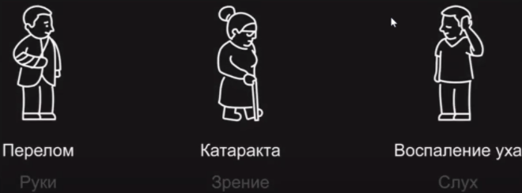

### Врождённые

- **Нарущение зрения** - слепота, близорукость или дальнозоркость, дальтонизм
- **Нарушение слуха** - глухота или тугоухость, звон в ушах
- **Нарушение моторики** - дрожание рук, деформация или отсутствие конечностей.
- **Проблемы восприятия** - дислексия, деменция, депривация сна.

## Вспомогательные технологии

Вспомогательные технологии - общее название технических средств для облегченя повседневной жизни людей с инвалидность. Например, скринридеры:

- NVDA
- Jaws
- Voiceover
- Backtalk

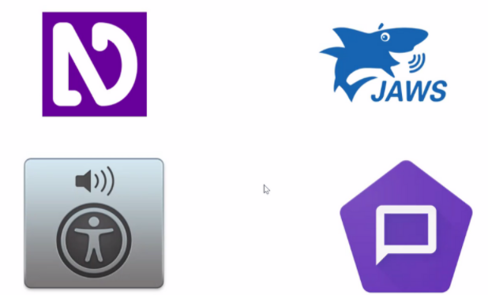

## Проектировка доступного проекта

Чтобы создать доступный продукт - нужно пройти несколько этапов.

1. Нужно детально продумать как именно вы будете представлять контент не только для обычных людей, но и для людей с ограниченными возможностями.
2. Нужно создать дизайн, который будет учитывать людей с ограниченными возможностями. Такой дизайн называется инклюзивным. Например - светофор. Люди, которые не различают цвета знают, что верхний - всегда красный, нижний - всегда зелёный. С точки зрения интерфейсов, идёт особый подбор цветов, который заключается в том, что даже если человек не различает цвета, он будет видеть контраст соприкасающихся объектов. Так же учитываются отступы, размеры шрифтов.
3. Нужно спрограммировать проект с реализацией доступности.

## 5 правил ARIA

- Используйте нативные HTML элементы, если таких элементов не нашлось то тогда создавайте свои кастомные
- Не переопределяйте нативную/встроенную семантику
- Все интерактивные элементы должны быть доступны с клавиатуры
- НЕ используйте `role="presentation"` или `aria-hidden="true"` для элементов с фокусом
- Все интерактивные элементы должны иметь доступное имя

## ARIA-аттрибуты

Позволяет задать роли и небольшой контекст элементам. Например при помощи `role="button"` можно придать `div`у роль кнопки. Больше информации:

[Using ARIA: Roles, states, and properties](https://developer.mozilla.org/en-us/docs/Web/Accessibility/ARIA/ARIA_Techniques)

## Tabindex

Позволяет переопределить или назначить порядок элементов для фокуса.

Можно добавить любому элементу `tabindex="1"`, то ему будет отдан приоритет при порядке перехода по элементам.

[https://codepen.io/a-ostrovnyy/pen/BaQarbP](https://codepen.io/a-ostrovnyy/pen/BaQarbP)

## Примеры доступных элементов

Можно установить себе скринридер и послушать как звучит всё это.

### Accordeon

[Accordion Example](https://w3c.github.io/aria-practices/examples/accordion/accordion.html)

### Хлебные крошки

[https://codepen.io/a-ostrovnyy/pen/NWbWBgM](https://codepen.io/a-ostrovnyy/pen/NWbWBgM)

### Модальное окно

[Modal Dialog Example](https://w3c.github.io/aria-practices/examples/dialog-modal/dialog.html)

### Подменю кнопок

[https://codepen.io/a-ostrovnyy/pen/gOLOjxx](https://codepen.io/a-ostrovnyy/pen/gOLOjxx)

### Список, который можно скроллить

[https://codepen.io/a-ostrovnyy/pen/JjbjBrd](https://codepen.io/a-ostrovnyy/pen/JjbjBrd)

### Вкладки

Автоматический режим: при помощи стрелочек переключаем открытую вкладку.

[https://codepen.io/a-ostrovnyy/pen/yLVLqzG](https://codepen.io/a-ostrovnyy/pen/yLVLqzG)

Ручной режим: при помощи стрелочек переключаем фокус, при помощи Enter открываем вкладку.

[https://codepen.io/a-ostrovnyy/pen/OJbJwOz](https://codepen.io/a-ostrovnyy/pen/OJbJwOz)

## Полезности

[Веблайнд - рекомендации по разработке сайтов для людей с нарушениями зрения](https://weblind.ru/)

[Inclusive Components](https://inclusive-components.design/)

[WAI-ARIA Authoring Practices 1.2](https://w3c.github.io/aria-practices/)

## Q & A

_Вопрос_

> Вкладка a11y в FireFox. Расскажите про неё.

_Ответ_

> Это так называемое "дерево доступности". Показывает структуру сайта с точки зрения доступности - как сайт будет "видеть" человек, пользующийся, например скринридером. Но инструмент пока в разработке, лучше пользоваться для тестирования самим скринридером.

---

_Вопрос_

> На реальном проекте как сильно нужна доступность? Есть какой-то "минимум" доступности?

_Ответ_

> Всё зависит от проекта и заказа - есть там доступность или нет. Обычно, минимумом является возможность хотя бы пользоваться проектом скринридером. В любом случае полность зависит от ТЗ.

---

# Работа с контентом

## Overflow wrap

Частая пробелма - ширина контента больше чем ширина родительского блока. Можно использовать `overflow-wrap: break-word`, но такой метод не добавляет дефис при переносе слов. Можно использовать `hypens`. Почитать про него можно тут:

[hyphens](https://developer.mozilla.org/ru/docs/Web/CSS/hyphens)

[https://codepen.io/a-ostrovnyy/pen/VwmwVpj](https://codepen.io/a-ostrovnyy/pen/VwmwVpj)

## Переполнение текстом

[https://codepen.io/a-ostrovnyy/pen/zYoYMVv](https://codepen.io/a-ostrovnyy/pen/zYoYMVv)

## Опциональный скролл

[https://codepen.io/a-ostrovnyy/pen/mdOdabX](https://codepen.io/a-ostrovnyy/pen/mdOdabX)

## Минимальная ширина

Не даёт сломаться интерфейсу, если контент меньше, чем предполагался.

[https://codepen.io/a-ostrovnyy/pen/yLVLGYB](https://codepen.io/a-ostrovnyy/pen/yLVLGYB)

## Иконки в инпутах

Если добавили иконку в начале инпута, а текст пишется поверх неё - нужно просто сделать отступ со стороны иконки внутри.

[https://codepen.io/a-ostrovnyy/pen/poNoqyz](https://codepen.io/a-ostrovnyy/pen/poNoqyz)

## Полезности

[CSS-Tricks](https://css-tricks.com/)

[Веб-стандарты](https://web-standards.ru/)

[Дайджест свежих материалов из мира фронтенда за последнюю неделю №451 (18 - 24 января 2021)](https://habr.com/ru/post/538972/)

[Home - Ahmad Shadeed](https://ishadeed.com/)

[Smashing Magazine - For Web Designers And Developers](https://www.smashingmagazine.com/)

## Q & A

_Вопрос_

> Как лучше сунуть значок в инпут - использовать псевдо-элемент или через фоновое изображение?

_Ответ_

> Особой разницы нет, можете сделать как угодно.

---

_Вопрос_

> Можно ли зарезервировать место под скролбар даже когда его нет?

_Ответ_

> Простым способом - нет. Можно высчитывать при помощи JS.
