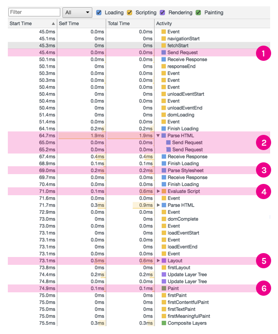

# Лекция 4. Браузер: документ, события, интерфейсы

**Лектор**: Христина Ландвитович
**Модуль**: HTML / CSS / JS DOM

[Назад](../../README.md)

## DOM
Для того чтобы браузер мог вытягивать из HTML какую-то полезную информацию, его нужно конвертировать в понятный для браузеров формат - **Document Object Model** или просто **DOM**.

Структура объектов DOM представлена тем, что называется *деревом узлов*. Его так называются потому, что его можно считать деревом с корневым элементом, от которого идёт несколько дочерних веток, каждая из которых так же может иметь листья. В таком случае, корень будет `<html>` элемент, дочерними "ветками" будут вложенные элементы, а "листьями" - содержание этих элементов.

## Как строится веб-страничка?
Процесс перехода от исходного HTML-документа до отображения стилизованной и интерактивной странички в окне просмотра называется **Критический путь визуализации** (Critical Rendering Path). Его можно разделить на два этапа:
  1. Синтаксический анализ документа для определения того, что в конечном итоге будет отображено на странице.
  2. Рендеринг

Результатом первого этапа называют **деревом визуализации**. Это представление элементов HTML, которые будут отображаться на странице, и связанных с ними стилей. Для построения этого дерева необходимы две вещи:
  - DOM, представление элементов
  - CSSOM, представление стилей, связанных с элементами

## Критический путь визуализации
CRP (Critical Rendering Path) имеет 6 этапов:
  1. Построение дерева DOM
  2. Построение дерева CSSOM
  3. Запуск JavaScript
  4. Создание дерева визуализации
  5. Создание макета
  6. Отрисовка по пикселям

## Как создаётся DOM (и как он выглядит)?
Дерево DOM (объектная модель документа) - это объектное представление полностью проанализированной HTML-страницы.
Начиная с корневого `<html>` узлы создаются для каждого элемента/текста на странице. Элементы, вложенные в другие элементы, представлены в виде дочерних узлов, и каждый узел содержит полные атрибуты для этого элемента. Например, узел элемента `<a>` будет содержать в себе атрибут `href`, который будет связан с этим узлом.

HTML может выполнятся частями. Не нужно ждать полной загрузки документа прежде чем содержание начнёт появляться на странице. Однако, другие ресурсы, CSS и JavaScript, могут блокировать визуализацию страницы.

## Построение дерева CSSOM
CSSOM (CSS Object Model) - это объектное представление стилей, связанных с DOM. Он похож на DOM, но ещё включает в себя стили для каждого узла, независимо от того, явно они оглашены или неявно унаследованы.

Дерево визуализации нельзя создать без заранее полностью проанализированного ресурса. В отличии от HTML, CSS нельзя использовать частями из-за его наследственной каскадной природы. Стили, которые определены позже в документе, могут заменять или изменять стили, которые были определены раньше.

CSS так же может "блокировать сценарий". Это потому, что файлы JavaScript должны подождать, пока CSSDOM не будет построен, перед тем как запускаться.

## Запуск JavaScript
Когда синтаксический анализатор достигает тега `<script>`, независимо от того, является ли он внутренним или внешним, он останавливается для получения скрипта (если он внешний) и его запуска. Вот почему, если у нас есть файл JavaScript, который посылается на элементы в документе, он должен быть размещён после появления этого элемента.

Чтобы избежать блокировки синтаксического анализатора JavaScript, его можно загружать асинхронно с применением атрибута `async`.

### Событие загрузки
После того, как синхронно загруженный JavaScript и DOM будут полностью проанализированы и готовы, будет сгенерировано событие `document.DOMContentLoaded`. Для любых сценариев, которым нужен доступ к DOM, например, для управления им или прослушивания событий взаимодействия с пользователем, рекомендуется сначала дождаться этого события перед выполнением сценариев.
```js
  document.addEventListener('DOMContentLoaded', (event) => {
    // You can now safely access the DOM
  })
```
После того, как всё остальное, например асинхронный JavaScript, изображение и т.д. завершили загрузку, запускается событие `window.load`.
```js
  window.addEventListener('load', (event) => {
    // The page has now fully loaded
  })
```

## Создание дерева визуализации
Дерево визуализации - это комбинация как DOM, так и CSSOM. Это дерево, которое представляет то, что в конечном счёте будет отображено на странице. Это означает, что оно включает в себя только видимое содержание и не будет включать в себя элементы, которые были спрятаны с помощью CSS правила `display: none`.

## Создание макета
Когда у нас есть полное дерево рендеринга, браузер знает, что рендерить, но не знает где. Ему необходимо рассчитать макет страницы (то есть положение и размер каждого узла). Механизм рендеринга проходит дерево рендеринга, начиная с вершины и двигаясь вниз, вычисляет координаты, в которых должен отображаться каждый узел.

Размер области просмотра определяется мета-тегом области видимости, который находится в голове документа, или, если такой тег не указан, используется ширина области просмотра по умолчанию (`980px`).
```html
  <meta name="viewport" content="width=device-width,initial-scale=1">
```
Если пользователь посещает веб-страницу с устройства с дисплеем шириной, например, 1000 пикселей, тогда размеры будут базироваться на этому блоке.

## Отрисовка
Как только всё это будет сделано, последний шаг - используя информацию о макете, превратить его в пиксели для отображения на экране.

## Подытожим
Таким образом в зависимости от размера DOM, а так же от того, какие стили используются, зависит сколько времени занимает шаг отображения (*eng Painting*). Некоторые стили требуют больше работы, чем другие. Например, сложное градиентное фоновое изображение требует больше времени, чем простой сплошной цветной фон.

Для того чтобы увидеть обработанный путь критичной визуализации, мы можем проверить его в DevTools. В Chrome он находится на вкладке Timeline.



На примере выше:
  1. Отправление `GET`-запроса для получения `index.html`
  2. Анализ HTML и отправление `GET`-запросов на дополнительные ресурсы. Начало синтаксического разбора HTML и DOM
  3. Синтаксический анализ таблицы стилей - CSSOM
  4. Оценка JavaScript сценариев
  5. Создание макета на основе мета-тега области просмотра HTML
  6. Отрисовка пикселей в окне браузера

## Чем DOM не является

### DOM не является исходным HTML
Существует два случая, когда DOM может отличаться от исходного HTML:
  1. Когда HTML недействителен
    DOM - это интерфейс для действительных документов HTML. Во время создания DOM браузер может исправлять некоторые ошибки в HTML-коде.
    Например, в документе может отсутствовать элемент `<head>`, который является требованием для HTML. Если мы посмотрим на полученное дерево DOM, то увидим, что это было исправлено.

  2. Когда DOM изменён при помощи JavaScript
    Помимо интерфейса для просмотра содержимого документа HTML, DOM так же можно изменить, что делает его живым ресурсом.
    Например, мы можем создать в DOM дополнительные узлы при помощи JavaScript. Это обновит DOM, но, конечно, не наш документ HTML.

### DOM - это не то, что вы видите в браузере (то есть дерево визуализации)
То, что вы видите в окне браузера, это дерево визуализации, которые является комбинацией DOM и CSSOM. Так как дерево визуализации включает в себя только элементы, которые видно на экране, в нём нет элементов, которые визуально скрыты. Хотя в DOM они присутствуют.

### DOM - это не то, что в DevTools
То, что показывает инспектор элементов DevTools довольно близким к DOM, но всё равно не является им. Он включает в себя дополнительную информацию, которую нет в DOM. Например, в структуре инспектора элементов есть элементы созданные псевдоклассами, но в DOM их нет. Именно по этому псевдоэлементы не могут быть целью сценариев JavaScript.

## Node vs Element node
Узел элемента является частным случаем узла DOM, как кошка является частным случаем животного.
`<html>`, `<head>`, `<title>`, `<body>`, `<h2>`, `<font color="#3AC1EF">`, `<p>` - это всё узлы элементов.
А вот, например, текстовые узлы, или узлы комментариев - не будут являться элементными узлами.

## Аттрибуты
Методы, которые у нас есть для модификации аттрибутов элементов:
  - `hasAttribute(attr)` - проверка на наличие определённого аттрибута (возвращает `true`/`false`)
  - `getAttribute(attr)` - возвращает значение определённого аттрибута
  - `setAttribute(attr, value)` - устанавливает значение определённого аттрибута
  - 'removeAttribute(attr)` - удаляет определённый аттрибут с элемента

## Какая разница между event handler и event listener в JS?
Для обработки событий можно использовать либо обработчик событий, либо слушатель событий.

Слушатель событий добавляется при помощи метода `addEventListener(eventType, callback(event))`, вызываемого на узле элемента. Например:
```js
  someElement.addEventListener('click', (event) => {
    // some actions
  })
  someElement.addEventListener('click', cbfunc)
```
Мы можем повесить сколько угодно слушателей любого события у элемента.

Обработчик события одного типа может быть только один и хранится в соответствующем аттрибуте. Можно добавить "инлайново" в html:
```hmtl
  <button onclick="function(event)">Press me</button>
```
или же через JS:
```js
  button.onclick = cbfunc
```

## Делегирование событий
В ситуации, когда нам нужно отслеживать большое количество элементов на предмет какого-то одного события (и при этом мы хотели бы выполнять одно и то же действие во всех случаях) вместо того, чтобы в ручную вешать слушатели событий на все эти элементы можно использовать делегирование событий.

Когда происходит какое-то событие, например, клик по кнопке, обработка такого события браузером происходит в 3 этапа:
  1. Фаза захвата (capture phase):
    Во время данной фазы, браузер проходится с самого внешнего элемента DOM-дерева вплоть до элемента, на котором произошло событие (в нашем случае - кнопка, которую мы нажали) и вызывает все слушатели события, которые настроены срабатывать во время фазы захвата.
  2. Фаза цели (target phase):
    Во время данной фазы срабатывает сначала обработчик событий, а затем все слушатели событий на кнопке на которому мы кликнули (имеется в виду слушатели, которые отслеживают именно клик). Слушатели событий вызываются в порядке добавления.
  3. Фаза всплытия (bubbling phase):
    Во время данной фазы браузер проходится от нашего целевого элемента к корню (в противоположную от фазы захвата сторону) и вызывает все слушатели событий, которые настроены срабатывать во время фазы всплытия.

По умолчанию все слушатели событий вызываются во время фазы всплытия. Чтобы установить слушатель событий на фазу захвата - необходимо передать третий аргумент (`true`) в метод `addEventListener('click', callback, true)`. 

Зная всё это можем привести пример:

```html
<div id="container">
  <button>First</button>
  <button>Second</button>
  <button>Third</button>
</div>
```

Если бы нам нужно было использовать какой-то слушатель событий, который должен был бы срабатывать при нажатии любой из кнопок, мы могли бы повесить слушатель на каждую кнопку, но это плохая практика, т.к. во-первых мы создадим много копий функции в памяти, и каждый раз при создании слушателя мы будем обращаться к DOM, что является *дорогим* по производительности действием. Вместо этого мы делаем следующее:

```js
const container = document.querySelector('#container')
container.addEventListener('click', (e) => {
  // some actions
})
```

Мы вешаем всего один слушатель событий на весь контейнер. Он будет срабатывать каждый раз, когда пользователь будет кликать на любой дочерний элемент контейнера. Мы всё ещё можем легко узнать на какую именно кнопку кликнул пользователь, т.к. в функцию-колбек всегда передаётся объект `event`, который содержит много информации о событии, на которое сработал слушатель. Поле `event.target` содержит элемент, на который сработало событие (в нашем случаи - кнопку, на которую кликнул пользователь.)

## `preventDefault` vs `stopPropagation` vs `stopImmediatePropagation`
Данные методы принадлежат объекту `event` который автоматически передаётся в функцию-колбек при срабатывании слушателя или обработчика событий.

### `preventDefault`
Данный метод останавливает любое стандартное поведение установленное для обработки события. Хорошим примером будет отключение поведения ссылки. Когда мы кликаем по ссылке нас пересылает на другую страницу, либо мы переходим к какому-то якорю на текущей странице. Мы можем остановить это поведение если повесим на ссылку обработчик событий, в котором укажем `e.preventDefault()`, где `e` - это объект `event`. 

### `stopPropagation`, `stopImmediatePropagation`
Данные методы предназначены для остановки распространение события. Их можно вызвать в функции колбеке одного из слушателей/обработчика события. `e.stopPropagation()` отключает срабатывание слушателей событий на всех элементах после того элемента, на котором сработал слушатель события. `e.stopImmediatePropagation()` отключает все слушатели события после того, в котором вызвано.

**Пример**:
HTML:
```html
  <div class="first">
    <div class="second">
      <div class="third">
        test
      </div>
    </div>
  </div>
```

JS:
```js
document.addEventListener('DOMContentLoaded', (e) => {
  const first = document.querySelector('.first')
  const second = document.querySelector('.second')
  const third = document.querySelector('.third')

  first.addEventListener('click', (e) => {
    console.log('first')
  })

  second.addEventListener('click', (e) => {
    console.log('second');
  }, true)

  second.addEventListener('click', (e) => {
    // e.stopPropagation()
    console.log('another second')
  },
    // true
  )

  second.addEventListener('click', (e) => {
    console.log('yet another second')
  })

  third.addEventListener('click', (e) => {
    console.log('third')
  })
})
```
Согласно фазам рассмотрим как браузер переберёт элементы при клике на слово `test`.

1. Начинается фаза захвата
2. Срабатывают слушатели событий на фазе захвата элемента `.first`
3. Срабатывают слушатели событий на фазе захвата элемента `.second`
4. Начинается фаза цели
5. Срабатывают слушатели событий на фазе цели элемента `.third`
6. Начинается фаза всплытия
7. Срабатывают слушатели событий на фазе всплытия элемента `.second`
8. Срабатывают слушатели событий на фазе всплытия элемента `.first`

Если запустить код как есть то в консоли будет выведено:
```
second
third
another second
yet another second
first
```

Если мы раскомментируем `e.stopPropagation()` и запустим скрипт, в консоли увидим:
```
second
third
another second
yet another second
```

Как видим, фаза всплытия остановилась на элементе `.second` и `first` уже не было выведено в консоль.

Если же мы заменим `e.stopPropagation()` на `e.stopImmediatePropagation()`, то в консоли увидим:
```
second
third
another second
```
При использовании этого метода, отключаются даже те слушатели событий, который находятся на том же элементе, на котором в данный момент мы вызвали `e.stopImmediatePropagation()`, в консоль уже не вывелось `yet another second`.

Мы так же можем прервать эту "передачу" событий и на фазе захвата. Если мы раскомментируем `true`, сделав слушатель событий нацеленным на фазу захвата, то обнаружим, что в консоль вывелось только:
```
second
another second
```
Таким образом, фаза захвата не дошла до нашего целевого элемента и в консоль не вывелось `third`. Конечно, фаза всплытия тоже не началась, по этому остальные обработчики так же не сработали.
