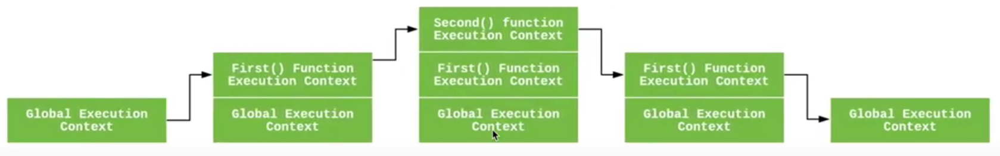

# Лекция 5. Scope, Closure

[Назад](../../README.md)

> Данный конспект является компоновкой информации из следующих видео:
> [https://www.youtube.com/watch?v=ft_8tuRj9CE&t=1s](https://www.youtube.com/watch?v=ft_8tuRj9CE&t=1s) > [https://www.youtube.com/watch?v=b52XdijI2ns&t=561s](https://www.youtube.com/watch?v=b52XdijI2ns&t=561s) > [https://www.youtube.com/watch?v=0Vb_Sse3xak&t=244s](https://www.youtube.com/watch?v=0Vb_Sse3xak&t=244s) > [https://www.youtube.com/watch?v=PIFGtdLgwi4&t=2s](https://www.youtube.com/watch?v=PIFGtdLgwi4&t=2s)

# Scope

Простыми словами, **область видимости** - это место, где мы ищем вещи. Что мы ищем? Идентификаторы.

```jsx
let x = 42;
console.log(y);
```

В данном примере мы записываем значение в `x` и берём значение из `y`. Все переменные в нашей программе либо получают новое значение, либо служат источником значения.

После того, как мы нашли переменную, нужно определить к какой области видимости она относится.

Движок джаваскрипт умеет определять к какой области видимости она относится.

## Компилируемый язык программирования

Вопреки распространённому мнению, JavaScript частично является компилируемым языком программирования. Перед тем, как код будет выполнен, идёт этап компилирования, во время которого компилятор проходит по коду и выполняет лексирование. На данном этапе JavaScript может заметить ошибки вроде синтаксических и лексических. Это происходит именно до _выполнения_ кода.

Начальные этапы компиляции кода выглядят так:

1. Токенизация/лексирование (разбивание кода на осмысленные токены)
2. Парсинг (создание абстрактного синтаксического дерева из потока токенов)
3. Генерация выполняемого кода

Именно абстрактное синтаксическое дерево содержит информацию обо всех областях видимости и переменных, которые им принадлежат.

# Execution context

Контекст выполнения - это концепт, который описывает окружение, в котором выполняется JS код. Код всегда выполняется в каком-то контексте.

В JS существуют 3 типа контекстов выполнения:

- Global - глобальный - базовый. Если код находится не внутри какой-то функции, он принадлежит глобальному контексту выполнения. Глобальный контекст в браузере это объект `window`.
- Function - контекст выполнения функции. Каждый раз, когда вызывается функция, для неё создаётся новый контекст. Каждая функция имеет свой контекст выполнения.
- Eval - контекст выполнения функции `eval()` .

# Execution stack

При обнаружении команды вызова функции, движок JS создаёт контекст выполнения данной функции и помещает его в стек вызовов. Когда функция завершает свою работу, она удаляется из стека вызовов. В данный момент управление возвращается предыдущему элементу стека (то есть той функции, которая вызвала ту, которая только что завершилась).

Пример:

```jsx
let string = "Hello to Execution Stack";
function first() {
  console.log("Inside first function");
  second();
  console.log("Again execution inside first function");
}

function second() {
  console.log("Inside second function");
}
first();
console.log("Inside Global Execution Context");
```

Для данного примера стек вызовов будет изменятся следующим образом:



## Стадии создания контекста

Перед выполнением кода создаётся контекст.

Концептуально, это можно описать так:

```jsx
ExecutionContext = {
	Thisinding = <this value>,
	LexicalEnvironment = { ... },
	VariableEnvironment = { ... },
}
```

Создаётся привязка `this`, а так же компоненты `LexicalEnvironment` и `VariableEnvironment`.

LexicalEnvironment - лексическое окружение - это структура, которая содержит сведения про разные идентификаторы и переменные. Под идентификатором подразумевается название переменной или функции, а под переменной - ссылка на конкретный объект или примитивное значение. В лексическом окружении есть 2 компонента:

- environment record - запись окружения - это место, где хранятся объявления переменных и фукнций
- reference to the outer environment - ссылка не внешнее окружение - наличие такой ссылки говорит о том, что у лексического окружения есть доступ к родительскому окружению

Бывают 2 типа лексических окружений:

- глобальное. В таком лексическом окружении нет ссылки на внешнее окружение. У него оно `null`. В глобальном лексическом окружении доступны такие сущности как `Object`, `Array` и т.д., которые позволяют работать с разными типами данных. Тут же находятся и глобальные переменные. Значение `this` в данном окружении указывает на глобальный объект.
- функциональное. В таком окружении находятся переменные, объявленные пользователем. Ссылка на внешнее окружение может указывать как на глобальный объект, так и на другое функциональное окружение (родительское для текущего).

Бывают 2 типа записей окружения:

- декларативная - сохраняет переменные, функций и параметров
- объектная - сохраняет сведения про переменные и функции в глобальном контексте

Лескическое окружение можно представить в виде следующего псевдокода:

```jsx
GlobalExecutionContext = {
	LexicalEnvironment: {
		EnvironmentRecord: {
			Type: "Object",
			// данные про связь для идентификаторов
		},
		outer: <null>,
		this: <global object>
	}
}
FunctionExecutionContext = {
	LexicalEnvironment: {
		EnvironmentRecord: {
			Type: "Declarative",
			// данные про связь для идентификаторов
		},
		outer: <Ссылка на родительское окружение>,
		this: <в зависимости от того, как вызывается function>
	}
}
```

### Окружение переменных

Это окружение, которое содержит привязки переменных, созданых при помощи команд variable statement в текущем контексте выполнения. Т.к. это окружение является так же лексическим, оно имеет все свойства лексического окружения. В ES6 разница в том, что в лексическое окружение попадают переменные, созданные при помощи `let` и `const`, а в окружение переменных попадают переменные, созданные при помощи `var`.

```jsx
let first = 1;
const second = 2;
var result;
function add(a, b) {
  var c = 15;
  return a + b + c;
}
result = add(49, 56);
```

Перед выполнением этого кода:

```jsx
GlobalExecutionContext = {
	LexicalEnvironment: {
		EnvironmentRecord: {
			Type: "Object",
			first: < uninitialized >,
			second: < uninitialized >,
			add: < func >
		},
		outer: <null>,
		ThisBinding: <Global Object>
	},
	VariableEnvironment: {
		EnvironmentRecord: {
			Type: "Object",
			result: undefined,
		},
		outer: <null>,
		ThisBinding: <Global Object>
	}
}
```

Позже:

```jsx
GlobalExecutionContext = {
	LexicalEnvironment: {
		EnvironmentRecord: {
			Type: "Object",
			first: 1,
			second: 2,
			add: < func >
		},
		outer: <null>,
		ThisBinding: <Global Object>
	},
	VariableEnvironment: {
		EnvironmentRecord: {
			Type: "Object",
			result: undefined,
		},
		outer: <null>,
		ThisBinding: <Global Object>
	}
}
```

Когда происходит вызов функции `add()`, создаётся новый контекст:

```jsx
FunctionExecutionContext = {
	LexicalEnvironment: {
		EnvironmentRecord: {
			Type: "Declarative",
			Arguments: {0: 49, 1: 56, length: 2},
		},
		outer: <GlobalLexicalEnvironment>,
		ThisBinding: <Global Object or undefined>,
	},
	VariableEnvironment: {
		EnvironmentRecord: {
			Type: "Declarative",
			c: undefined,
		},
		outer: <GlobalLexicalEnvironment>,
		ThisBinding: <Global Object or undefined>
	}
}
```

Позже:

```jsx
FunctionExecutionContext = {
	LexicalEnvironment: {
		EnvironmentRecord: {
			Type: "Declarative",
			Arguments: {0: 49, 1: 56, length: 2},
		},
		outer: <GlobalLexicalEnvironment>,
		ThisBinding: <Global Object or undefined>,
	},
	VariableEnvironment: {
		EnvironmentRecord: {
			Type: "Declarative",
			c: 15,
		},
		outer: <GlobalLexicalEnvironment>,
		ThisBinding: <Global Object or undefined>
	}
}
```

# Hoisting

Магического "всплытия" некоторых строчек кода наверх блок не существует.

Рассмотрим пример:

```jsx
student;
book;

var student = "Tom";
var book = "YDKJS";
```

Хоть объявление переменных и происходит позже, чем получение доступа к ним, ошибки не будет. Это происходит потому что компилятор проходит код перед его выполнением и знает что дальше по коду будет объявление данных переменных. Фактически, он создаёт переменную сразу, просто не присваивает ей значение.

Хорошим тоном программирования является объявление переменных в начале кода.

# Closure

Замыкание - это возможность функции сохранить доступ к своей лексической области видимости, а так же переменным за её пределами (свободным переменным). Таким образом, функция может получить доступ к своей области видимости, выполняться в другой области видимости.

Пример:

```jsx
function find(closure) {
  setTimeout(function waitASec() {
    console.log(closure);
  }, 1000);
}
find("Hi there");
```

В данном примере `"Hi there"` будет передано как аргумент в функцию `find`. Там это значение попадёт в переменную `closure`, которая доступна в области видимости функции `find`. Она так же доступна и всем её дочерним функциям, в данном случае мы используем её в теле функции `waitASec()`. Суть в том, что когда функция `waitASec()` запустится через одну секунду, она сможет получить доступ к `closure`, которая находится за пределами её личной области видимости. Казалось бы, функция `find` давно завершила своё выполнение, но функция `waitASec()` замкнула в себе переменную `closure` и по этому всё ещё имеет к ней доступ. Переменные, которые были замкнуты не чистятся сборщиком мусора как раз по этой причине.
