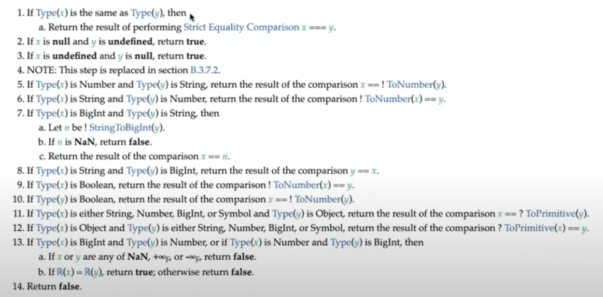

# Лекция 8. Типы в JS

[Назад](../../README.md)

# Static vs Dynamic typing

Принято делить все значения на определённые группы - типы. Знание типа значения позволяет компилятору\интерпретатору понять, какое количество памяти нужно выделять под определённое значение и какие операции с ним можно производить. В JS если мы пытаемся произвести какую-то операцию над значением, которая не доступна его типу, мы получаем `TypeError`.

Языки программирования делятся на вид типизации:

- динамическая
- статическая

В языках программирования со статической типизацией, мы указываем тип переменной при её создании. В таком случае программа выделяет под неё определённое количество памяти и данная переменная будет принадлежать только этому типу данных до конца жизни программы. Одним из плюсов статической типизации является то, что некоторые ошибки, связанные с типизацией, можно обнаружить сразу во время компиляции программы.

В языках с динамической типизацией мы не указываем тип переменной и он может меняться во время работы программы. Ошибки, связанные с типизацией в языках с динамической типизацией могут быть выявлены только во время рантайма программы.

# Типы в JS

В JS динамическая типизация. На уровне спецификации в JS есть 8 типов данных:

- Undefined
- Null
- Boolean
- String
- Symbol
- Number
- BigInt
- Object

Все типы кроме Object являются примитивными, т.к. содержат только значение своего типа данных. Объекты же могут содержать множество значений любых типов данных.

С практической точки зрения тип данных Object так же стоит разделять на подтипы. Данные типы являются по своей сути объектами, но имеют специфическое поведение, отличное от обычного объекта (функции можно вызывать, у массивов есть автообновляемое свойство `.length` и т.д.):

- Function
- Array
- Promise
- Map
- ...

## Как определить тип

### typeof

Оператор `typeof` позволяет нам узнать к какому типу принадлежит значение. Но его минус в том, что он не всегда предоставляет достаточно информации о типе. Этот оператор возвращает строку с названием типа. Эти строки для каждого типа данных:

- Undefined - `"undefined"`
- Null - `"object"`
- Boolean - `"boolean"`
- Number - `"number"`
- BigInt - `"bigint"`
- String - `"string"`
- Symbol - `"symbol"`
- Function - `"function"`
- Любой другой объект - `"object"`

### Функции-хелперы

Есть некоторые функции, которая позволяют нам определить, относится ли значение к определённому типу данных. Это такие функции как `Array.isArray()`, `Number.isNaN()` и т.д. Они возвращают булевое значение `true` / `false`.

_NaN принадлежит к типу данных number._

### Утиная типизация

> Если что-то ходит как утка, выглядит как утка и крякает как утка, скорее всего это утка.

Идея в том, что нам не всегда нужно быть сто процентов уверенным в происхождении или подлинности какого-то типа данных, нам достаточно быть уверенными что этот тип данных демонстрирует поведение, на которое мы расчитываем. Например, если у чего-то есть свойство `.then()` и это функция, то мы в некоторой степени можем быть уверены что это промис.

# Natives

Когда в браузере запускается наш скрипт JS, в нём создаётся глобальный объект, на котором распологается очень много различных свойств. В том числе на нём же распологаются функции-конструкторы для наших типов данных. Они отвечают за то, что на массивах, например, есть методы `.forEach()`, `.map()` и т.д. Например есть функция `Array()`. Если мы посмотрим на `Array.prototype`, то увидим все эти полезные методы.

Так как это фактически конструкторы, мы можем использовать такой код как `new Date` или `new Error`. Мы могли бы делать то же самое для массивов и объектов, но их лучше создавать при помощи литералов `[ ]` и `{ }`.

А с примитивными типами данных ситуация странная. Например:

```jsx
if (new Boolean(false)) {
  console.log("true");
}
// true

new Boolean(false).valueOf();
false;
```

Из данного примера видно, что `new` создаёт именно объект. Хоть его "значение" и будет равно `false`, мы не можем использовать его как обычное примитивное значение, т.к. при приведении типов (например в `if`), объект является truthy значением, несмотря на значение `false`. Таким образом мы получаем именно объект, а не примитивное значение.

Возникает так же вопрос, откуда на, например, примитивном значении-строке метод `.toUpperCase()` и остальные. Дело в том, что при вызове такого метода, JS оборачивает строку в объект и вызывает метод.

Мы так же можем использовать функции `String()`, `Number()` и т.д. для приведения типов. Например `String(123)` вернёт строку, а `Number('123')` вернёт число.

Мы так же можем использовать эти функции для проверки на типы. Например, `[] instanceof Array` вернёт `true`.

# Приведение типов (Type coercion)

Приведение типов бывает явным и неявным. Для явного приведения типов мы используем соответствующие инструменты, например, описанные ранее. То есть мы явно говорим в коде что хотим привести _это число к строчному типу_. Неявное приведение происходит, когда JS посчитает нужным (например, если нужно произвести над данными какую-то операцию, которая невозможна для текущего типа этих данных).

## Abstract Equiality Comparison

В спецификации есть алгоритм сравнения двух значений (`==`). В спецификациях есть такое понятие как абстрактные операции, то есть это такие операции, которые не доступны разработчиком и ипользуются только в спецификации или "под капотом". Например, операция `Type()` возвращает тип данных, но настоящий, то есть она распознаёт все 8 типов данных, в отличаи от `typeof`, которая доступна разработчикам.



Приведение типов происходит только к примитивным типам данных. Мы можем привести что-то к **строке**, **числу** или **булевому значению**.

**Интересный пример:**

```jsx
0 == Number.prototype; // true
```

`Number.prototype` является объектом, но при сравнении с числом, он превращается в `0`.

Один из инструментов для приведения, доступных разработчикам - `.valueOf()`. Данный метод имеется на многих типах данных и позволяет привести непримитивный тип данных к примитивному. В данном случае, `Number.prototype.valueOf()` равняется `0`.

Точно так же можно получить:

```jsx
String.prototype.valueOf(); // ""
Boolean.prototype.valueOf(); // false
```

Чтобы доказать что данный метод используется JS автоматически под капотом, мы можем его переписать и увидеть старнное поведение:

```jsx
Number.prototype.valueOf = function () {
  return 42;
};
new Number(1) + 2; // 44
```

Здесь мы видим, что при создании числа в объектной обёртке мы пытаемся использовать его как примитив, складывая с другим примитивом при помощи оператора `+`. Из-за этого, у него вызывается метод `.valueOf()`, который у нас теперь всегда возвращает `42`.

_Ещё одним подобным "удобным" методом является `toString()`, который приводит к строке_.

## Немного про абстрактные вещи в спецификации

В JS спецификации нет такого понятия как _а вот тут происходит непонятно что_ или _а вот здесь может быть или строка или число, мы не знаем_. Любые действия движка происходят строго согласно алгоритму, прописанному в спецификации.

Абстрактные вещи скрыты от прямого доступа для разработчиков. Это такие вещи как метод `[[Call]]` у функций, взятие типа данных значения `Type()` и т.д. Они используются в спецификации для объяснения алгоритма. Например, в спецификациии, в приведении типов, когда нужно привести какое-то значение к числу, используется метод `ToNumber()`. Он не доступен нам как разработчикам, но мы можем ожидать от него конкретное поведение, т.к. в спецификации есть табличка со всеми возможными значениями, которые этот метод может получить, и значениями которые он может вернуть.


Базируясь на этом, мы не знаем _как именно_ JS приводит разные типы данных к числовому, но знаем _что получиться_ в итоге.

Спецификацию можно найти вот здесь:

[ECMAScript® 2022 Language Specification](https://tc39.es/ecma262/)
