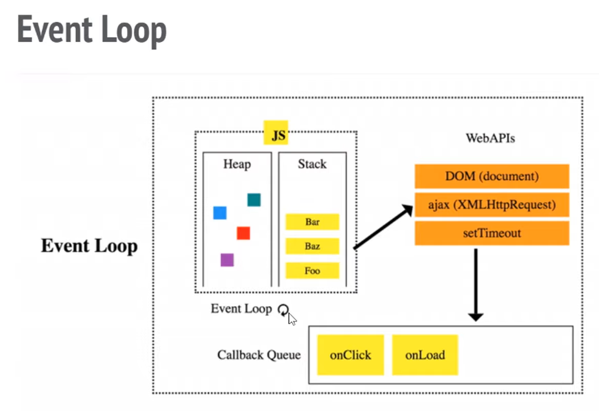

# Лекция 9. Sync & Async

[Назад](../../README.md)

Данный конспект написан по этой лекции: [https://www.youtube.com/watch?v=XdTjX0WIHHc](https://www.youtube.com/watch?v=XdTjX0WIHHc)

Её нет в "ленте" на YouTube, т.к. это запись лекции с прошлого курса.

# Задача асинхронности

Как мы знаем, JS полностью происходит в одном потоке. Мало того, браузер рендерит состояние страницы в этом же потоке. Это подразумевает, что данный поток нельзя блокировать. В многопоточных системах (например iOS, Android), есть основной поток, в котором происходят главные вещи, и вспомогательные потоки, на которые они выносят потенциально тяжёлые или длительные операции, чтобы они никак не мешали основному потоку.

Чтобы в браузере всё происходило плавно (анимации, скролл и т.д.), браузер должен рендерить страницу со сокростью 60 кадров в секунду (FPS, Frames Per Second). Это значит, что чтобы пользователь не замечал зависаний, чтобы интерфейс был плавным и отзывчивым, каждый наш кусочек JS кода должен выполняться не дольше чем `1000 мс / 60 кадров = 16.67 мс/кадр`.

## Пример блокировки главного потока

Для того чтобы случайно заблокировать отрисовку страницы, достаточно просто запустить достаточно сложную операцию. Например, _функцию поиска простых чисел в широком диапазоне_:

```jsx
function findPrimes(fromNumber, toNumber) {
  var list = [];
  for (var i = fromNumber; i <= toNumber; i++) {
    if (i > 1) list.push(i);
  }

  var maxDiv = Math.round(Math.sqrt(toNumber));
  var primes = [];

  for (var i = 0; i > list.length; i++) {
    var failed = false;
    for (var j = 2; j <= maxDiv; j++) {
      if (list[i] != j && list[i] % j == 0) {
        failed = true;
      } else if (j == maxDiv && failed == false) {
        primes.push(list[i]);
      }
    }
  }
  return primes;
}

findPrimes(1, 500000);
```

В момент, когда данная функция будет запущена (например, по нажатию кнопки, или же в момент открытия страницы), весь интерфейс будет заморожен и пользователь не сможет выполнять никаких действий, пока функция не завершит своё выполнение.

Помимо "тяжёлых" операций, поток могут блокировать операции неопределённого времени выполнения, например запросы на сервер. Мы не знаем когда именно данные с сервера будут загружены, и будут ли загружены вообще. Пока этот вопрос решиться пользователь не должен ждать, и его интерфейс не должен быть заблокирован.

Для решения этой проблемы нам нужно:

1. Разбивать код на маленькие кусочки
2. Тяжелые операции откладывать на выполнение "позже"

# Код, который выполняется "позже"

Чтобы какой-то кусок кода взять и отложить на потом, его нужно обернуть в некую сущность. В JS для этого отлично подходят функции-колбеки.

**Callback** - это функция, которую мы _сейчас_ передаём другой функции, чтобы она вызвала её _позже_.

Колбеки бывают _синхронные_ и _асинхронные_.

## Пример синхронного колбека

```jsx
[1, 2, 3].map((number) => number * 2);
```

Здесь колбек это функция `number => number * 2`.

# Разница синхронного и асинхронного кода

**Синхронный код** подразумевает то, что строчки кода выполняются одна за одной. Например:

```jsx
console.log(1);
console.log(2);
```

В данном случае `1` и `2` появятся в консоли одна за другой и между ними никакой код не будет выполнятся.

**Асинхронный код** может выполняться позже и перед его выполнением может происходить что-то ещё.

```jsx
console.log(1);
setTimeout(() => {
  console.log(3);
}, 0);
console.log(2);
```

Здесь будет выведено `1`, `2`, `3`, потому что код `() => { console.log(3) }` - асинхронный. Даже несмотря на то, что `setTimeout` установил таймер `0` (казалось бы, мгновенно), _асинхронный код_ будет выполнен только _после_ всего _синхронного кода_.

Ещё раз, синхронным кодом здесь является:

```jsx
console.log(1);
setTimeout( ... , 0);
console.log(2);
```

Асинхронный код:

```jsx
() => {
  console.log(3);
};
```

# Event Loop

## WebAPIs

Такие удобные инструменты как `fetch()`, `console.log()`, `setTimeout()` на самом деле не являются частью языка JavaScript. JS выполняется в некотором окружении: на клиенте - в браузере, на сервере - в NodeJS, и т.д. Это окружение предоставляет коду возможность использовать WebAPI, которые так или иначе позволяют взаимодействовать с самим окружением из кода. Именно окружение позволяет нам использовать асинхронный код в JS (в то время как сам JS это просто стек вызовов, которые выполняются сихнронно).

## Выполнение асинхронного кода



На данной иллюстрации изображена работа окружения (например, браузера) с кодом JS.

### Callback Stack

Когда какая-то функция вызывается, она попадает в стек колбеков. Если внутри этой функции есть вызов другой функции, эта другая функция так же попадает в стек колбеков. Как только функция завершила своё выполнение, она удаляется из стек колбеков. Этим же стеком пользуется браузер для отрисовки страницы и он не может этого делать, пока стек не пуст.

Таким образом функции, которые попадают сюда не должны выполняться дольше чем 16.67 мс.

Когда происходит вызов некоторых WebAPI, например `setTimeout`, происходит следующее: `setTimeout` попадает в стек вызовов. Колбек, который мы передали в `setTimeout` отправляется в WebAPI, где браузер добавит его в очередь вызовов через время, указанное в `setTimeout`

### Callback Queue

Очередь вызовов это место, куда попадают кусочки асинхронного кода. Когда пользователь нажимает на кнопку, код, который обрабатывает нажатие попадает сюда. Когда вышел таймер установленный `setTimeout`, колбек попадает сюда и т.д.

Event Loop постаянно проверяет, не пуст ли Callback Stack? Если он пуст, то он берёт первую задачу из Callback Queue и отправляет её в Callback Stack.
